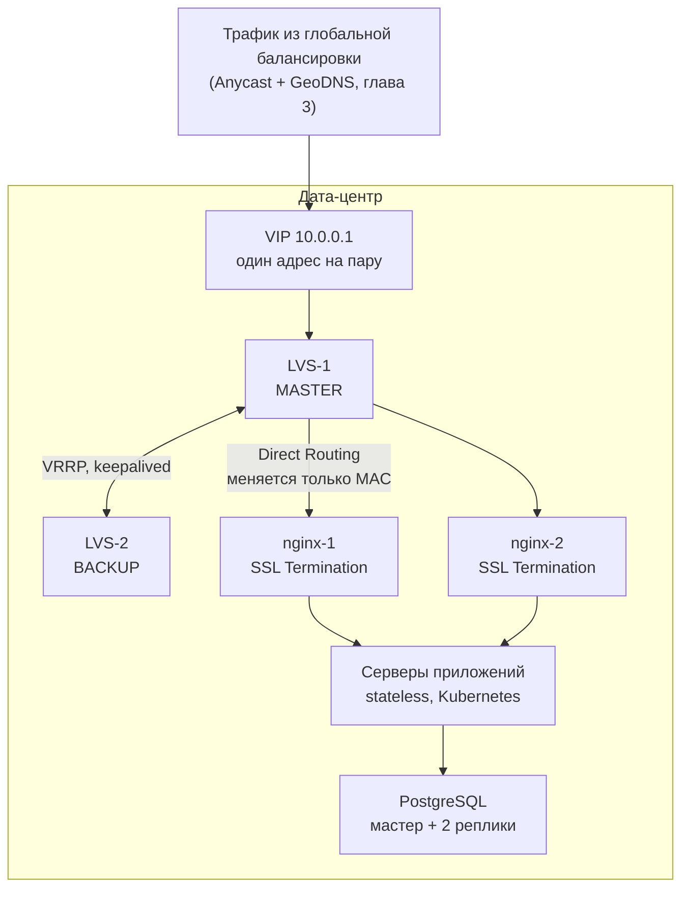

# Расчётно-пояснительная записка

**Дисциплина:** Проектирование высоконагруженных систем  
**Тема:** Бэкенд B2C-логистического сервиса: оформление отправлений, трекинг и управление сетью (на примере СДЭК)

## Оглавление
1. [Тема и целевая аудитория](#глава-1-тема-и-целевая-аудитория)  
2. [Расчёт нагрузки](#глава-2-расчёт-нагрузки)  
3. [Топология инфраструктуры и распределение нагрузки](#глава-3-топология-инфраструктуры-и-распределение-нагрузки)  
4. [Локальная балансировка нагрузки](#глава-4-локальная-балансировка-нагрузки)  
5. [Источники](#источники)  

---

## Глава 1. Тема и целевая аудитория

### 1.1. Тема и рыночная ниша
Проектируется бэкенд логистического сервиса. Через него отправитель оформляет посылку, получатель следит за её движением, а пункты выдачи (ПВЗ) и курьеры сообщают системе о перемещении груза в реальном времени.  
**Реальный аналог:** СДЭК.  
За 2025 год через сервис прошло более 123 млн отправлений [1]. Компания обслуживает 18 млн физических лиц и имеет более 8800 ПВЗ и постаматов [2].

### 1.2. Ключевые особенности системы
Эти особенности напрямую влияют на архитектуру:
1. **Два потока записи.** Заказы создают пользователи, но основной поток изменений статуса генерируют сканеры на складах и терминалы ПВЗ.
2. **Публичный трекинг.** Статус посылки можно узнать по номеру накладной без входа в аккаунт. Это значит, что трафик не всегда привязан к сессии пользователя, но его можно эффективно кэшировать по номеру посылки.
3. **Партнёрский API.** Значительная часть заказов создается автоматически через интеграции с интернет-магазинами.
4. **Постаматы как объект состояния.** Система хранит не только статус посылки, но и занятость каждой ячейки постамата, превращая справочник в часто обновляемое состояние.

### 1.3. Функционал MVP
1. Оформление отправления (расчет стоимости, выбор ПВЗ, создание накладной).
2. Приём событий от сети (сканы ТСД, терминалов ПВЗ, геотреки).
3. Трекинг (лента событий посылки для пользователя и публично по номеру).
4. География и сеть (справочник ПВЗ, режим работы, занятость ячеек).
5. Уведомления (Push и SMS при смене статуса).
6. Регистрация и авторизация.
7. Партнёрский API (создание накладных оптом, опрос статусов, исходящие вебхуки интернет-магазинам).

### 1.4. Расчёт аудитории (MAU и DAU)
Аудитория считается от реального физического объема бизнеса (числа отправлений).

**Опорные величины:**
| Обозначение | Величина | Значение | Источник |
| :--- | :--- | :--- | :--- |
| `P_год` | Отправлений за 2025 г. | 123 млн | [1] |
| `P_сут` | Отправлений в сутки (среднее) | 337 тыс. | 123 млн / 365 дней |
| `C_год` | Физических лиц в базе | 18 млн | [2] |
| `N_пвз` | ПВЗ и постаматов | 8800 | [2] |

*Проверка `P_сут`:* в отчёте эмитента за III квартал 2025 года указан среднесуточный объём 318,6 тыс. накладных [4]. Наш расчёт даёт 337 тыс. — расхождение 6%, что объяснимо: III квартал не включает предновогодний пик. Две независимые цифры сходятся.

**Расчёт месячной аудитории (MAU):**
1. **Получатели:** В месяц приходит 10,25 млн посылок (123 млн / 12). Согласно структуре отправлений [3], чисто корпоративные B2B-грузы составляют 7%. Следовательно, 93% отправлений (10,25 млн × 0,93 = 9,53 млн) приходится на сегменты с участием физических лиц (B2C, C2C, международные). 
   *Обоснование частоты:* средний онлайн-покупатель делает 19 заказов в год, то есть ~1,6 в месяц [12]. Часть заказов уходит другим операторам доставки (маркетплейсы, Почта), поэтому через один сервис человек получает реже — берём 1,5 посылки в месяц. 
   *Расчет уникальных получателей:* `9,53 млн / 1,5 = 6,36 млн`.
2. **Отправители (C2C):** На сегмент C2C приходится 15% [3] от всех отправлений (1,54 млн в месяц). 
   *Обоснование частоты:* Отправления C2C (например, продажа вещей на Авито, отправка подарков) носят эпизодический характер. Средняя частота оценивается в ~1,25 отправления на активного отправителя в месяц.
   *Расчет уникальных отправителей:* `1,54 млн / 1,25 = 1,23 млн`. С учетом того, что ~60% из них уже учтены как получатели (пересечение аудиторий), добавляем уникальных: `1,23 млн × 0,40 = 0,49 млн`.
3. **Пользователи без активной посылки — 3,0 млн.** Это люди, которые открывают сервис, но не участвуют в отправлении или получении именно в этом месяце. Они заходят, чтобы рассчитать тариф перед покупкой, найти ближайший ПВЗ, отследить через приложение посылки других служб доставки (приложение поддерживает трекинг более 100 операторов) или зайти в программу лояльности.
   
   *Обоснование цифры:* Месячная аудитория мобильного приложения превышала 4 млн ещё до перезапуска в формате SuperApp [5], после которого активная аудитория выросла на 43% [6], то есть составила ≈ 5,7 млн только в мобильном канале. Транзакционные пользователи (получатели и отправители), приходящиеся на приложение (около 60% от всех), дают ≈ 4,1 млн; остаток ≈ 1,6 млн — это нетранзакционные пользователи мобильного приложения. Веб-канал, где сосредоточен анонимный трекинг и расчёт тарифов, добавляет ещё ≈ 1,4 млн. Итого: `1,6 + 1,4 = 3,0 млн`.

**Итого MAU:** `6,36 + 0,49 + 3,00 = 9,85 млн человек`.

**Расчёт суточной аудитории (DAU):**
Средний жизненный цикл посылки — 5 суток. Согласно [11] доставка от 1 до 10 суток, взято среднее значение. Посылок в системе одновременно в день: `337 тыс. × 5 = 1,68 млн`.
Получателей с активной посылкой: `1,68 / 1,25 = 1,35 млн`.
Получатель заходит в приложение не каждый день, а примерно в 3 дня из 5 (при создании, прибытии в город, готовности к выдаче). Активных получателей в сутки: `1,35 × (3/5) = 0,81 млн`.

| Составляющая DAU | Расчёт | Значение, млн |
| :--- | :--- | ---: |
| Получатели с активной посылкой | 1,35 × 3/5 | 0,81 |
| Отправители C2C | 337 тыс. × 15% [3] | 0,10 |
| Пользователи без активной посылки | 3,0 млн × 8% | 0,24 |
| Анонимный трекинг и кабинеты магазинов | оценка | 0,20 |
| **Итого DAU** | | **1,35** |

*Обоснование показателя 8%:* Пользователи с активной посылкой заходит в сервис очень часто (3 из 5 дней, т.е. ~60%), периферийная аудитория закономерно имеет гораздо более низкую ежедневную активность. Показатель 8% означает, что такой пользователь открывает приложение в среднем раз в 12–13 дней (например, для расчёта тарифа или проверки программы лояльности), что является стандартной отраслевой оценкой для нетранзакционных сценариев в утилитарных приложениях.

*Проверка:* `DAU / MAU = 1,35 / 9,85 = 13,7%`. Это идеальный показатель для утилитарных приложений (отраслевая норма 10–20% [7]).

---

## Глава 2. Расчёт нагрузки

### 2.1. Коэффициенты пиковой нагрузки
Пиковый RPS раскладывается на множители: `K = K_сезон × K_час × K_минута`.
Для пользовательского трафика: `2,2 (декабрь/распродажи) × 1,80 (вечерний пик с учетом часовых поясов) × 1,3 (неравномерность внутри часа) = 5,15`. Для фоновых системных процессов коэффициенты ниже, так как они более равномерны.

| Контур | K | Почему |
| :--- | ---: | :--- |
| Пользовательский | **5,15** | `2,2 × 1,80 × 1,3` |
| Операционный (склады, ПВЗ) | **4,0** | `2,2 × 1,80`: сезон и ночное окно сортировки; внутри часа поток ровный |
| Партнёрский API (создание накладных) | **7,8** | Пакетные выгрузки магазинов перед распродажей |
| Опрос статусов, геотреки | **2,2** | Работают по расписанию, суточного пика почти нет |
| Телеметрия постаматов, выгрузка справочника | **1,2** | Строго по расписанию, поток почти постоянный |

### 2.2. Маршрут посылки: 15 событий трекинга
Это ключевая величина главы: от неё считаются и сканы складов, и вебхуки, и уведомления, и объём истории в БД. Каждое событие — одно сканирование на ТСД или терминале ПВЗ:

приём у отправителя → приёмка на складе отправления → сортировка → погрузка на магистраль → отправка рейса → прибытие в транзитный хаб → сортировка в хабе → погрузка → прибытие в город получателя → приёмка на складе → сортировка на доставку → передача курьеру или в ПВЗ → прибытие в ПВЗ → готово к выдаче → выдано. **Итого 15 сканов.**

Из этих 15 событий:
- **5 интересны интернет-магазину** (приём, отправка рейса, прибытие в город, готово к выдаче, выдано) — столько вебхуков мы отправляем партнёру, остальные 10 это внутренние перемещения;
- **4 уходят push-уведомлением получателю** (принята, прибыла в город, готова к выдаче, выдана).

### 2.3. Сводная таблица RPS (запросов в секунду)

| Тип запроса | Контур | Запросов, млн/сут | Средний RPS | Пиковый RPS |
| :--- | :--- | ---: | ---: | ---: |
| Просмотр карточки отслеживания | Пользовательский | 4,05 | 47 | 242 |
| Приём сканов ТСД и ПВЗ | Операционный | 5,05 | 58 | 234 |
| Старт сессии (bootstrap) | Пользовательский | 2,70 | 31 | 161 |
| Подсказки адреса и карта ПВЗ | Пользовательский | 1,87 | 22 | 111 |
| Геотреки курьеров | Операционный | 2,88 | 33 | 73 |
| Отправка push и SMS | Уведомления | 1,25 | 14 | 70 |
| Исходящие вебхуки магазинам | Партнёрский | 1,38 | 16 | 64 |
| Опрос статусов партнёрами (API) | Партнёрский | 2,36 | 27 | 60 |
| Телеметрия занятости ячеек постаматов | Операционный | 2,53 | 29 | 35 |
| Создание накладных по API | Партнёрский | 0,28 | 3 | 25 |
| Проверка свободных ячеек пользователями | Пользовательский | 0,40 | 5 | 24 |
| Оформление отправления | Пользовательский | 0,30 | 3 | 18 |
| Выгрузка справочника ПВЗ партнёрами | Партнёрский | 0,20 | 2 | 3 |
| Добавление и изменение ПВЗ | Административный | 0,0003 | <0,01 | <0,1 |
| **ИТОГО** | | **~25,3** | **~292** | **~1120** |

*Как считалось:*

**Исходные данные:** DAU = 1,35 млн; отправлений в сутки = 337 тыс.; активных посылок в системе = 1,68 млн (337 тыс. × 5 суток жизненного цикла); партнёрских отправлений в сутки = 276 тыс. (337 тыс. × 82%: доли B2C 75% и B2B 7% [3]).

**Формулы:**
- `Запросов, млн/сут = Число действий × API-вызовов на действие`
- `Средний RPS = (Запросов, млн/сут × 1 000 000) / 86 400`
- `Пиковый RPS = Средний RPS × Коэффициент пика`

**Расчёт по строкам (млн/сут):**
- **Просмотр трекинга (4,05):** 1,35 млн заходов в сервис × 3 API-вызова (список отправлений, карточка заказа, лента событий). Число заходов равно DAU: активный пользователь открывает приложение один раз в сутки, когда ему приходит уведомление о смене статуса.
- **Приём сканов ТСД (5,05):** 337 тыс. посылок/сут × 15 событий на посылку (список событий — в разделе 2.2).
- **Старт сессии (2,70):** те же 1,35 млн заходов × 2 API-вызова (обновление токена + конфигурация клиента). Эта строка по определению меньше трекинга: на один заход приходится 2 служебных вызова против 3 вызовов на показ посылки, отношение `4,05 / 2,70 = 1,5` это ровно отношение 3 к 2.
- **Подсказки адреса и карта ПВЗ (1,87):** карту открывает каждый пятый заход (0,27 млн), на один поиск приходится 6 запросов точек при сдвигах и зуме карты = 1,62 млн; плюс геокодер при оформлении: 50,5 тыс. адресов × 5 подсказок при наборе = 0,25 млн.
- **Геотреки курьеров (2,88):** курьером «до двери» доставляется 21% посылок [13], это `337 тыс. × 0,21 = 71 тыс.` доставок в сутки; при 30 доставках на курьера за смену нужно ~2400 курьеров × 1200 точек за смену (пинг раз в 30 сек в течение 10 часов).
- **Push/SMS (1,25):** 313 тыс. посылок физлицам (337 тыс. × 93%, без B2B [3]) × 4 уведомления (раздел 2.2). *Пик считается не коэффициентом, а шириной окна:* склад завершает сортировку пачкой, поэтому 40% статусов «готово к выдаче» уходят в 30-минутное окно: `313 тыс. × 0,4 / 1800 с = 70 RPS`.
- **Вебхуки партнёрам (1,38):** 276 тыс. партнёрских посылок × 5 клиентских событий из 15 (раздел 2.2).
- **Опрос партнёрами (2,36):** 1,68 млн активных посылок × 35% (доля посылок тех партнёров, кто опрашивает API вместо вебхуков: публичный endpoint для вебхуков настраивают далеко не все магазины) × 4 опроса в день (каждые 6 часов).
- **Телеметрия ячеек постаматов (2,53):** постаматов в сети ~1760 (20% от 8800 точек [2]), каждый раз в минуту сообщает, какие из ячеек заняты: `1760 × 1440 = 2,53 млн`. Пользователь не должен выбрать уже занятую ячейку, поэтому состояние обновляется часто — это даёт постоянные 29 RPS на запись.
- **Создание накладных по API (0,28):** 276 тыс. партнёрских посылок × 1 вызов.
- **Проверка свободных ячеек (0,40):** пользователи при выборе постамата (0,27 млн открытий карты) + курьеры при закладке посылки (67 тыс. посылок в постаматы × 2 запроса).
- **Оформление (0,30):** 50,5 тыс. заказов C2C/сут (337 тыс. × 15% доля C2C [3]) × 6 API-вызовов (расчёт тарифа, валидация адреса, поиск ПВЗ, создание накладной, оплата, подтверждение).
- **Выгрузка справочника ПВЗ (0,20):** более 200 тыс. подключённых магазинов [4] × 1 синхронизация справочника в сутки.
- **Добавление и изменение ПВЗ (0,0003):** сеть растёт примерно на 20% в год (за год открыто более 130 ПВЗ только за рубежом [8]), это `8800 × 0,2 / 365 ≈ 5` новых точек в сутки; плюс правки карточек (режим работы, телефон, временное закрытие) — каждый ПВЗ примерно раз в месяц: `8800 / 30 ≈ 293` в сутки. Итого ~300 запросов в сутки.

**Про две строки с маленьким RPS.** Добавление ПВЗ даёт меньше 0,01 RPS и на выбор железа не влияет, но строку нельзя убирать: справочник ПВЗ читают все остальные контуры (карта, оформление, выгрузка партнёрам, маршрутизация посылок), поэтому запись в него должна быть строго консистентной и обязана сбрасывать кеши карты и партнёрских выгрузок. То же с ячейками: суммарно телеметрия и чтения дают 2,93 млн запросов в сутки и 59 RPS в пике, и это отдельное быстрое хранилище состояния, а не основная СУБД.

### 2.4. Хранение данных
| Тип данных | шт./мес | Размер записи | ГБ/мес | Срок хранения |
| :--- | ---: | ---: | ---: | :--- |
| События трекинга | 151,6 млн | 0,40 КБ | 60,7 | 36 мес |
| Накладные и заказы | 10,2 млн | 4,00 КБ | 41,0 | 60 мес |
| Журнал партнёрского API | 126,6 млн | 0,25 КБ | 31,7 | 3 мес |
| Геотреки курьеров | 86,4 млн | 0,06 КБ | 5,2 | 3 мес |
| Фотофиксация (объектное хранилище) | 5,1 млн | 250 КБ | 1281,0 | 12 мес |
| **Итого структурных (сырые)** | | | **~139 ГБ/мес** | |

*Как считалось:*

**Исходные данные:** отправлений в год = 123 млн; отправлений в сутки = 337 тыс.; отправлений в месяц = 10,25 млн.

**Расчёт по строкам (шт./мес):**
- **События трекинга (151,6 млн):** 337 тыс. посылок/сут × 15 событий на посылку × 30 дней = 151,65 млн.
- **Накладные и заказы (10,2 млн):** 123 млн посылок/год / 12 месяцев = 10,25 млн.
- **Журнал партнёрского API (126,6 млн):** сумма партнёрских строк таблицы 2.3 (2,36 опросов + 1,38 вебхуков + 0,28 созданий + 0,20 выгрузок = 4,22 млн/сут) × 30 дней.
- **Геотреки курьеров (86,4 млн):** 2,88 млн точек в сутки (расчёт в разделе 2.3) × 30 дней.
- **Фотофиксация (5,1 млн):** 10,25 млн посылок/мес × 25% (доля посылок с фотофиксацией — ценные грузы, спорные случаи) × 2 фото (приём и выдача).

**Размеры записей:**
- Событие трекинга (0,4 КБ): ID посылки, timestamp, код статуса, ID точки, ID сотрудника, координаты GPS, метаданные.
- Накладная (4,0 КБ): данные отправителя/получателя, габариты, вес, тариф, стоимость, состав вложения, метаданные.
- Журнал API (0,25 КБ): timestamp, ID партнёра, тип запроса, ID посылки, HTTP-статус ответа.
- Геотрек (0,06 КБ): ID устройства, timestamp, широта, долгота, скорость, направление.
- Фото (250 КБ): JPEG, ~12 МП, сжатие.

**Сроки хранения:**
- События трекинга (36 мес / 3 года): для разрешения претензий и судебных споров.
- Накладные (60 мес / 5 лет): первичный бухгалтерский документ согласно ФЗ-402 «О бухгалтерском учёте».
- Журнал API и геотреки (3 мес): для расследования инцидентов и отладки интеграций.
- Фото (12 мес): для споров о повреждении/утере, хранятся в объектном хранилище (S3).

**Итоговый объём:** 60,7 + 41,0 + 31,7 + 5,2 = 138,6 ГБ/мес сырых данных (округляем до 139 ГБ/мес). Фотофиксация (1281 ГБ/мес) хранится отдельно в S3 и не нагружает основную СУБД.

*Расчет накладных расходов СУБД:*  
Сырые данные: 139 ГБ/мес.  
+ индексы и WAL-журнал (×1,6): 222 ГБ/мес.  
+ три реплики для надежности (×3): **~0,67 ТБ/мес**.  
За горизонт хранения (3-5 лет) структурные данные займут около **24–40 ТБ**. Фотофиксация хранится в объектном хранилище (S3) и не нагружает основную СУБД.

**Средний размер хранилища на пользователя:** `139 ГБ/мес × 36 мес / 9,85 млн MAU ≈ 0,5 МБ` структурных данных плюс ~1,6 МБ фотографий.

### 2.5. Сетевой трафик
Трафик по типу = пиковый RPS × средний размер ответа.

| Тип трафика | Размер ответа | Пиковый RPS | Пик, Мбит/с | ГБ/сут |
| :--- | ---: | ---: | ---: | ---: |
| Пользовательские ответы (трекинг, карта, сессия, ячейки, оформление) | ~10 КБ | 556 | 46 | 93 |
| Выгрузка справочника ПВЗ партнёрами | 500 КБ | 3 | 12 | 100 |
| Машинный трафик (сканы, геотреки, вебхуки, опрос статусов, телеметрия, уведомления) | ~1 КБ | 561 | 5 | 16 |
| Загрузка фотофиксации в объектное хранилище | 250 КБ | 10 | 20 | 43 |
| **ИТОГО** | | **1120** | **~83 (0,08 Гбит/с)** | **~250** |

**Выводы:**
- Пиковая нагрузка на канал — около **0,08 Гбит/с**, то есть стандартного интерфейса 1 Гбит/с хватает более чем десятикратно. Система ограничена количеством запросов (RPS) и скоростью базы данных, а не шириной канала.
- Самый «тяжёлый по байтам» метод — выгрузка справочника ПВЗ: всего 3 RPS, но 500 КБ на ответ дают 100 ГБ/сут, то есть **40% суточного трафика при 0,8% запросов**. Отсюда проектное решение: справочник надо отдавать инкрементально (только изменения с момента последней синхронизации) и со сжатием.
- Фото загружаются напрямую в объектное хранилище по presigned URL, минуя серверы приложений, поэтому их 20 Мбит/с не нагружают балансировщики.

---

## Глава 3. Топология инфраструктуры и распределение нагрузки

### 3.1. Расположение дата-центров (ЦОД)
Для обеспечения скорости и надежности используются три дата-центра:
1. **Москва:** Основной хаб. Здесь находится большая часть пользователей и центральные офисы.
2. **Новосибирск:** Географический центр. Обеспечивает низкую задержку для пользователей Урала, Сибири и Дальнего Востока — это УФО, СФО и ДФО, где живёт 36,6 млн человек, то есть 25% населения страны [10].
3. **Алматы:** Хаб для стран СНГ. **Важно:** законодательство Казахстана требует, чтобы персональные данные граждан РК хранились на территории страны [8, 9]. Поэтому для казахстанского сегмента выделен отдельный, изолированный контур в Алматы.

### 3.2. Распределение нагрузки

- **Пользовательский трафик** (мобильное приложение, сайт) направляется в ближайший ЦОД (Москва или Новосибирск) для максимальной скорости отклика.
- **Фоновый машинный трафик** (сканы со складов, вебхуки интернет-магазинам, рассылка уведомлений) не требует мгновенной реакции человека. Cпециально направляем около 50% этого трафика в Новосибирск. Это выравнивает нагрузку: Москва не перегружается, а Новосибирск работает в полную силу, а не простаивает как «холодный» резерв.

### 3.3. Распределение нагрузки и ёмкость (защита от каскадного отказа)

Для избежания сценария каскадного отказа и оптимизации затрат на инфраструктуру применён принцип «Равная производственная мощность, взвешенная маршрутизация». 

Чтобы система выдержала падение любого одного из трёх ЦОД, оставшиеся два должны быть способны принять его нагрузку. Следовательно, физическая ёмкость каждого ЦОД настроена на **55% от пиковой нагрузки всей системы** (что даёт 50% для покрытия чужой нагрузки + 5% запаса безопасности).

| ЦОД | Доля трафика (норма) | Физическая ёмкость | Свободный резерв |
| :--- | :---: | :---: | :---: |
| Москва | 40 % | 55 % | 15 % |
| Новосибирск | 30 % | 55 % | 25 % |
| Алматы | 30 % | 55 % | 25 % |
| **ИТОГО** | **100 %** | **165 %** | **65 %** |

**Сценарии аварийной ситуации (математика отказоустойчивости):**

- **Сценарий 1: Падение Москвы (40% трафика).**  
  Нагрузка равномерно распределяется на Новосибирск и Алматы (+20% к каждому).  
  - Новосибирск: 30% + 20% = 50% (не превышает ёмкость 55%).  
  - Алматы: 30% + 20% = 50% (не превышает ёмкость 55%).  
  *Система работает без деградации.*  

- **Сценарий 2: Падение Новосибирска (30% трафика).**  
  Нагрузка распределяется на Москву и Алматы (+15% к каждому).  
  - Москва: 40% + 15% = 55% (равно максимальной ёмкости 55%).  
  - Алматы: 30% + 15% = 45% (не превышает ёмкость 55%).  
  *Система работает без деградации.*

- **Сценарий 3: Падение Алматы (30% трафика).**  
  Нагрузка распределяется на Москву и Новосибирск (+15% к каждому).  
  - Москва: 40% + 15% = 55% (равно максимальной ёмкости 55%).  
  - Новосибирск: 30% + 15% = 45% (не превышает ёмкость 55%).  
  *Система работает без деградации.*  
  *(Важно: из-за требований законодательства РК о локализации данных, персональные данные граждан РК не покидают контур Алматы. При его падении казахстанский сегмент временно переходит в режим «только чтение» для публичного трекинга, пока узел не будет восстановлен).*

### 3.4. Сети и балансировка (Anycast и GSLB)
- **Anycast-подсеть `185.X.X.0/24`:** используется для публичного API (мобильное приложение B2C, трекинг, ТСД курьеров). Анонсируется со всех 3-х ЦОД через BGP, что позволяет маршрутизировать трафик до ближайшего узла на сетевом уровне.
- **GeoDNS (GSLB):** используется для веб-интерфейса. Отдельные пулы GSLB-записей выделены для казахстанского сегмента, чтобы направлять локальный трафик в Алматы и соблюдать регуляторные требования РК.

---

## Глава 4. Локальная балансировка нагрузки

### 4.1. Схема балансировки и механизмы резервирования

Внутри ЦОД балансировка многоуровневая: каждый уровень решает свою задачу и имеет свою защиту от сбоев.

| Уровень | Технология | Задача | Механизм резервирования |
| :--- | :--- | :--- | :--- |
| **Глобальный (L3)** | Anycast (BGP) + GeoDNS | Направление пользователя в ближайший дата-центр (Москва, Новосибирск или Алматы). | Маршрутизация на уровне провайдеров. При падении одного ЦОД трафик автоматически уходит в другой. |
| **Сетевой (L4)** | LVS (Linux Virtual Server) в режиме Direct Routing (DR) | Приём миллионов пакетов и очень быстрая передача их на серверы приложений без изменения IP-адреса. | Протокол **VRRP** (через `keepalived`). Один узел работает (MASTER), второй ждёт в резерве (BACKUP). |
| **Прикладной (L7)** | Nginx | Расшифровка HTTPS (SSL Termination), умная маршрутизация по URL, защита от медленных клиентов (буферизация). | Режим **Active-Active**. Все узлы работают одновременно и делят нагрузку. |
| **Внутренний** | kube-proxy / Service в Kubernetes | Балансировка межсервисных вызовов и service discovery. | Экземпляр попадает в реестр только после успешной readiness-пробы, упавший перезапускается на другом узле. |

**Почему Direct Routing.** Обратный трафик в разы больше входящего: пользователь отправляет короткий запрос, а получает карточку на 8 КБ или список точек карты. При режиме NAT весь ответный поток шёл бы через балансировщик и грузил его процессор, а при Direct Routing ответы идут от серверов приложений напрямую клиенту. Плата за это — все серверы должны быть в одной физической сети, но внутри одного ЦОД это выполняется.

**Проверка работоспособности узлов.** `keepalived` считает узел живым, если тот отвечает на HTTP-запрос `GET /healthz`, а не просто принимает TCP-соединение: nginx может держать порт открытым, когда приложение за ним уже недоступно.

### 4.2. Формула резервирования

| Формула | Смысл | Где применяем | Почему |
| :--- | :--- | :--- | :--- |
| **N + 1** | N узлов держат пиковую нагрузку, плюс один резервный | Балансировщики L7 (nginx), серверы приложений | Все узлы в работе, резерв нужен только на время отказа или обновления одного узла. Экономнее, чем 2N |
| **2N** | Полное дублирование: рабочий комплект и равный ему резервный | Узлы L4 (LVS), СУБД | VIP-адресом физически владеет ровно один узел, «поделить» его нельзя. Резерв простаивает, зато переключение занимает секунды |

Для балансировщиков L7 применяем **N + 1**.

### 4.3. Расчёт количества балансировщиков

**Шаг 1. Входные данные.**
Пиковая нагрузка всей системы — **1120 RPS** (таблица 2.3). Добавляем запас на рост (×2): **2240 RPS**. Каждый ЦОД по главе 3 рассчитан на 55% нагрузки системы, значит на один ЦОД приходится:

`2240 × 0,55 = 1232 RPS`

**Шаг 2. Ограничение: SSL Termination.**
Расшифровка HTTPS сильно нагружает процессор. Согласно тестам производительности Nginx [15], один стандартный узел (4 vCPU) обрабатывает около **10 000 HTTPS-соединений в секунду (CPS)**.

`1232 / 10 000 = 0,12 узла`

Это оценка с запасом: TLS-рукопожатие происходит один раз на соединение, а дальше по нему идут десятки запросов (keep-alive), так что реальное число новых соединений ещё меньше.

**Шаг 3. Ограничение: пропускная способность сети.**
Стандартный сетевой порт сервера — **1 Гбит/с**, это 125 МБ/с. Средний ответ весит ~10 КБ (раздел 2.5), значит канал выдержит:

`125 000 КБ/с / 10 КБ = 12 500 RPS` → `1232 / 12 500 = 0,10 узла`

**Шаг 4. Определение узкого места.**

| Ограничитель | Ёмкость 1 узла | Требуется | Узлов |
| :--- | ---: | ---: | ---: |
| SSL Termination | 10 000 CPS | 1232 CPS | **0,12** |
| Пропускная способность сети | 12 500 RPS | 1232 RPS | 0,10 |

Узкое место — **SSL Termination**, оно и определяет N. Обработка самих запросов ограничением не является: по тестам Nginx один узел проксирует порядка 30 000 RPS [14], что в разы больше наших 1232 RPS.

**Шаг 5. Итоговый расчёт по формуле N + 1.**
1. Округляем до целого в большую сторону: **N = 1**.
2. Применяем формулу резервирования: `1 + 1 = 2`.

**Итог:** требуется **2 балансировщика L7 (nginx)** в каждом активном дата-центре плюс **пара LVS по схеме 2N** на уровне L4. По нагрузке хватило бы и одного узла — она загружает балансировщик лишь на 12%, поэтому количество определяется не нагрузкой, а отказоустойчивостью: при отказе или обновлении одного узла второй мгновенно берёт на себя весь трафик.

**Запас по росту.** Один узел перестаёт справляться по SSL, когда пиковая нагрузка системы достигает `10 000 / 2 / 0,55 ≈ 9000 RPS`, то есть при росте примерно в 8 раз относительно текущих 1120 RPS. До этого момента схема «2 узла на ЦОД» остаётся достаточной.

---

## Источники

1. [ТАСС: «Пользователи СДЭК в 2025 году отправили более 123 млн посылок» (23.01.2026)](https://tass.ru/ekonomika/26229815) — основной якорь расчёта: 123 млн отправлений за 2025 год.
2. [Пресс-релиз к 25-летию СДЭК (26.02.2025), публикация Retail.ru](https://www.retail.ru/rbc/pressreleases/sdek-nameren-stat-otkrytoy-predprinimatelskoy-platformoy-dlya-biznesa/) — данные о клиентской базе (18 млн физических лиц), размере сети (более 8800 ПВЗ).
3. [Аналитический отчёт по отчётности ООО «СДЭК-Глобал» за 2024 год, ИК «Юнисервис Капитал»](https://inform.uscapital.ru/sdek/Analiz_otczetnosti_OOO_SDEK-Global_31.12.2024.pdf) — структура отправлений: 75% B2C, 15% C2C, 7% B2B, 3% международные.
4. [Отчёт эмитента ООО «СДЭК-Глобал» за III квартал 2025 года](https://uscinvest.ru/storage/SecurityDocument/220/file/6496/%D0%A1%D0%94%D0%AD%D0%9A-%D0%93%D0%BB%D0%BE%D0%B1%D0%B0%D0%BB---%D0%90%D0%9E---3-%D0%BA%D0%B2-2025.pdf) — среднесуточный объём 318,6 тыс. накладных, более 200 тыс. подключённых интернет-магазинов.
5. [Конкурсная заявка проекта «Перезапуск мобильного приложения CDEK в концепции SuperApp»](https://contest.festivalsreda.ru/works/13102/) — месячная аудитория мобильного приложения превышает 4 млн пользователей.
6. [Кейс перезапуска приложения CDEK, Workspace.ru](https://workspace.ru/cases/perezapusk-mobilnogo-prilozheniya-cdek-v-koncepcii-superapp/) — прирост активной аудитории на 43% после перехода к формату SuperApp.
7. [Сводка отраслевых бенчмарков вовлечённости (со ссылкой на оценку Sequoia Capital)](https://www.shno.co/marketing-statistics/user-engagement-statistics) — типовой диапазон DAU/MAU для потребительских приложений составляет 10–20%.
8. [РБК Компании: «СДЭК за прошедший год открыл более 130 ПВЗ за рубежом»](https://companies.rbc.ru/news/Bgv3V7wrbQ/sdek-za-proshedshij-god-otkryil-bolee-130-pvz-za-rubezhom/) — лидер по числу открытий зарубежных ПВЗ — Казахстан; оценка темпа роста сети ПВЗ.
9. [Zakon.kz: «СДЭК на рынке Казахстана» (21.11.2024)](https://www.zakon.kz/ekonomika-biznes/6456911-sdek-na-rynke-kazakhstana-kak-adaptirovatsya-k-kulturnym-osobennostyam.html) — обоснование необходимости локального контура для соблюдения требований к хранению персональных данных.
10. [Росстат: численность населения Российской Федерации на 1 января 2025 года](https://www.interfax.ru/russia/1005747) — распределение по федеральным округам для расчёта географического распределения нагрузки.
11. [СДЭК - время доставки](https://www.cdek.ru/ru/faq/receiving/sroki-dostavki/) — сроки доставки от 1 до 10 суток, использованы для расчёта жизненного цикла посылки (5 суток).
12. [Портрет среднего онлайн-покупателя в 2025 году (по данным «Известий» и площадок)](https://selsup.ru/blog/kto-i-kak-pokupaet-na-marketplejsah-v-2025-godu-portret-srednego-onlajn-pokupatelya/) — 19 заказов в год на одного онлайн-покупателя (~1,6 в месяц), использовано для частоты получения посылок.
13. [TAdviser: «Курьеры в России»](https://www.tadviser.ru/index.php/%D0%A1%D1%82%D0%B0%D1%82%D1%8C%D1%8F:%D0%9A%D1%83%D1%80%D1%8C%D0%B5%D1%80%D1%8B_%D0%B2_%D0%A0%D0%BE%D1%81%D1%81%D0%B8%D0%B8) — 79% доставок приходится на ПВЗ, постаматы и B2B, 21% — курьером «до двери»; использовано для расчёта числа курьеров и геотреков.
14. [Nginx Blog: Testing the Performance of the NGINX Ingress Controller (2019)](https://blog.nginx.org/blog/testing-performance-nginx-ingress-controller-kubernetes) — данные о пропускной способности (TPS) и работе балансировщика в среде Kubernetes.
15. [Nginx Blog: Testing the Performance of NGINX and NGINX Plus Web Servers (2017)](https://blog.nginx.org/blog/testing-the-performance-of-nginx-and-nginx-plus-web-servers) — данные о количестве HTTPS-соединений в секунду (CPS) при включенном SSL Termination, использованные для расчёта ограничений.
