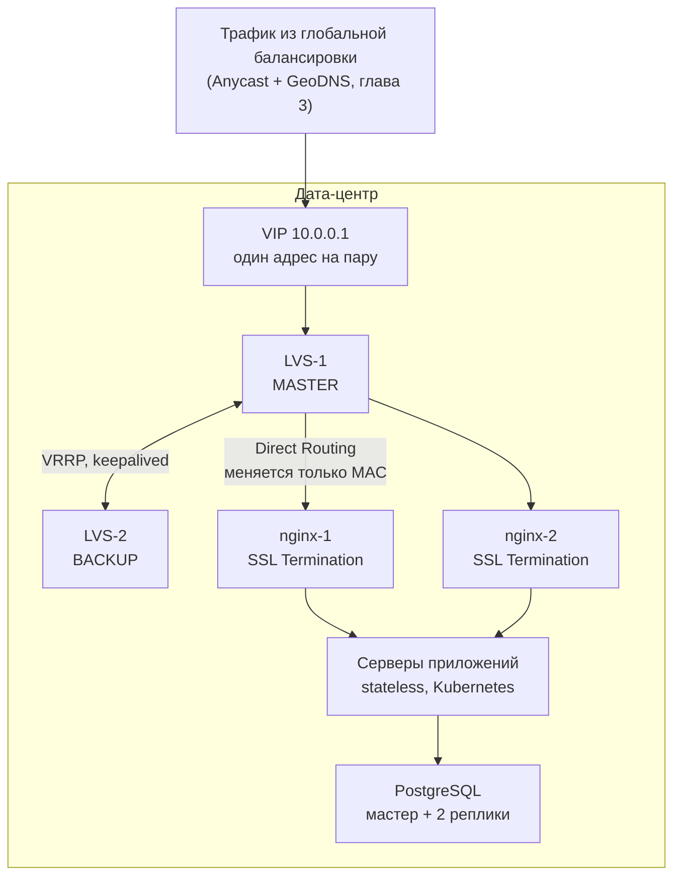
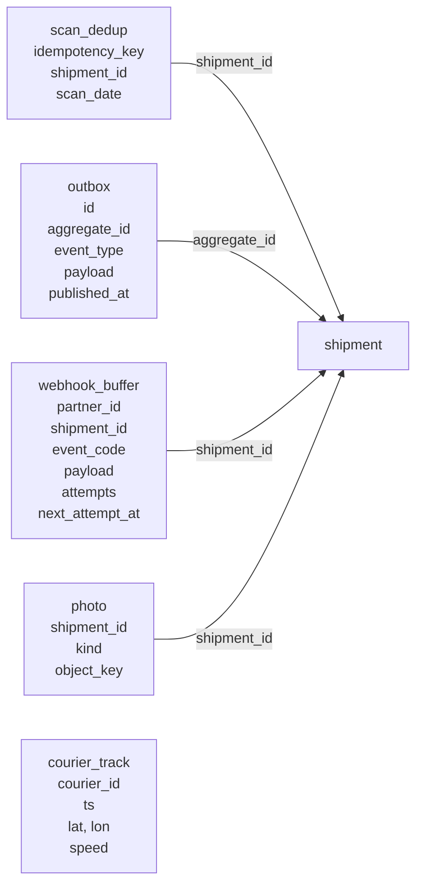
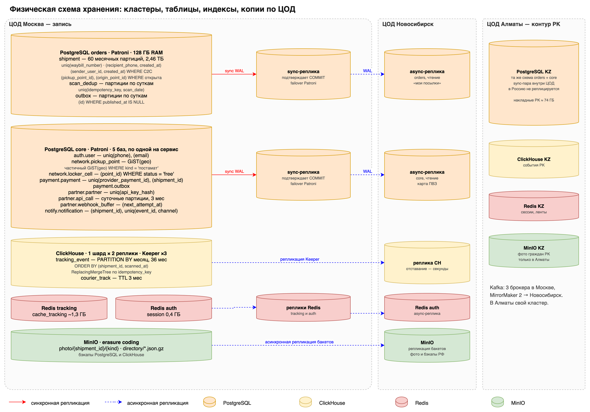

# Расчётно-пояснительная записка

**Дисциплина:** Проектирование высоконагруженных систем  
**Тема:** Бэкенд B2C-логистического сервиса: оформление отправлений, трекинг и управление сетью (на примере СДЭК)

## Оглавление
1. [Тема и целевая аудитория](#глава-1-тема-и-целевая-аудитория)  
2. [Расчёт нагрузки](#глава-2-расчёт-нагрузки)  
3. [Топология инфраструктуры и распределение нагрузки](#глава-3-топология-инфраструктуры-и-распределение-нагрузки)  
4. [Локальная балансировка нагрузки](#глава-4-локальная-балансировка-нагрузки)  
5. [Логическая схема БД](#глава-5-логическая-схема-бд)  
6. [Физическая схема БД](#глава-6-физическая-схема-бд)  
7. [Алгоритмы](#глава-7-алгоритмы)  
8. [Технологии](#глава-8-технологии)  
9. [Обеспечение надёжности](#глава-9-обеспечение-надёжности)  
10. [Схема проекта](#глава-10-схема-проекта)  
11. [Список серверов](#глава-11-список-серверов)  
[Источники](#источники)  

---

## Глава 1. Тема и целевая аудитория

### 1.1. Тема и рыночная ниша
Проектируется бэкенд логистического сервиса. Через него отправитель оформляет посылку, получатель следит за её движением, а пункты выдачи (ПВЗ) и курьеры сообщают системе о перемещении груза в реальном времени.  
**Реальный аналог:** СДЭК.  
За 2025 год через сервис прошло более 123 млн отправлений [1]. Компания обслуживает 18 млн физических лиц и имеет более 8800 ПВЗ и постаматов [2].

### 1.2. Ключевые особенности системы
Эти особенности напрямую влияют на архитектуру:
1. **Два потока записи.** Заказы создают пользователи, но основной поток изменений статуса генерируют сканеры на складах и терминалы ПВЗ.
2. **Публичный трекинг.** Статус посылки можно узнать по номеру накладной без входа в аккаунт. Это значит, что трафик не всегда привязан к сессии пользователя, но его можно эффективно кэшировать по номеру посылки.
3. **Партнёрский API.** Значительная часть заказов создается автоматически через интеграции с интернет-магазинами.
4. **Постаматы как объект состояния.** Система хранит не только статус посылки, но и занятость каждой ячейки постамата, превращая справочник в часто обновляемое состояние.

### 1.3. Функционал MVP
1. Оформление отправления (расчет стоимости, выбор ПВЗ, создание накладной).
2. Приём событий от сети (сканы ТСД, терминалов ПВЗ, геотреки).
3. Трекинг (лента событий посылки для пользователя и публично по номеру).
4. География и сеть (справочник ПВЗ, режим работы, занятость ячеек).
5. Уведомления (Push и SMS при смене статуса).
6. Регистрация и авторизация.
7. Партнёрский API (создание накладных оптом, опрос статусов, исходящие вебхуки интернет-магазинам).

### 1.4. Расчёт аудитории (MAU и DAU)
Аудитория считается от реального физического объема бизнеса (числа отправлений).

**Опорные величины:**
| Обозначение | Величина | Значение | Источник |
| :--- | :--- | :--- | :--- |
| `P_год` | Отправлений за 2025 г. | 123 млн | [1] |
| `P_сут` | Отправлений в сутки (среднее) | 337 тыс. | 123 млн / 365 дней |
| `C_год` | Физических лиц в базе | 18 млн | [2] |
| `N_пвз` | ПВЗ и постаматов | 8800 | [2] |

*Проверка `P_сут`:* в отчёте эмитента за III квартал 2025 года среднесуточный объём — 318,6 тыс. накладных [4]. Расхождение с нашими 337 тыс. — `(337 − 318,6) / 318,6 = 5,8%`: III квартал не включает предновогодний пик.

**Расчёт месячной аудитории (MAU):**
1. **Получатели:** В месяц приходит 10,25 млн посылок (123 млн / 12). Согласно структуре отправлений [3], чисто корпоративные B2B-грузы составляют 7%. Следовательно, 93% отправлений (10,25 млн × 0,93 = 9,53 млн) приходится на сегменты с участием физических лиц (B2C, C2C, международные). 
   *Обоснование частоты:* средний онлайн-покупатель делает 19 заказов в год, то есть ~1,6 в месяц [12] (`19 / 12 = 1,58`). Часть заказов уходит другим операторам доставки (маркетплейсы, Почта), поэтому через один сервис человек получает реже — берём 1,5 посылки в месяц. 
   *Допущение:* отдельного замера «посылок СДЭК на человека в месяц» нет. 1,5 — это 1,58 из [12], округлённые вниз на одну десятую.
   *Расчет уникальных получателей:* `9,53 млн / 1,5 = 6,36 млн`.
2. **Отправители (C2C):** На сегмент C2C приходится 15% [3] от всех отправлений (1,54 млн в месяц: `10,25 × 0,15 = 1,54`). 
   *Допущение по частоте:* отправления C2C (продажа на Авито, подарки) эпизодические. Берём 1,25 отправления на активного отправителя в месяц: одно отправление и редкий повтор в том же месяце. Опубликованной частоты нет.
   *Расчет уникальных отправителей:* `1,54 млн / 1,25 = 1,23 млн`. 
   *Допущение по пересечению:* кто отправляет, тот обычно и получает. Берём 60% уже учтённых как получатели; замера пересечения нет. Добавляем уникальных: `1,23 млн × (1 − 0,60) = 1,23 млн × 0,40 = 0,49 млн`.
3. **Пользователи без активной посылки — 3,0 млн.** Это люди, которые открывают сервис, но не участвуют в отправлении или получении именно в этом месяце. Они заходят, чтобы рассчитать тариф перед покупкой, найти ближайший ПВЗ, отследить посылки других служб доставки или зайти в программу лояльности.

   *Обоснование цифры:* Месячная аудитория мобильного приложения превышала 4 млн ещё до перезапуска в формате SuperApp [5], после которого активная аудитория выросла на 43% [6], то есть составила `4 × 1,43 = 5,72 ≈ 5,7 млн` только в мобильном канале. Транзакционные пользователи — `6,36 + 0,49 = 6,85 млн`. 
   *Допущение по каналам:* на приложение приходится 60% транзакционных пользователей (`6,85 × 0,60 = 4,1 млн`); замера доли каналов нет. Остаток приложения: `5,7 − 4,1 = 1,6 млн` — нетранзакционные пользователи мобильного канала. Веб, где сидят анонимный трекинг и расчёт тарифов, — ещё 1,4 млн; это тоже допущение, отдельной веб-аудитории в источниках нет. Итого: `1,6 + 1,4 = 3,0 млн`.

**Итого MAU:** `6,36 + 0,49 + 3,00 = 9,85 млн человек`.

**Расчёт суточной аудитории (DAU):**
Средний жизненный цикл посылки — 5 суток. Согласно [11] доставка от 1 до 10 суток. Середина диапазона `(1 + 10) / 2 = 5,5`; распределение внутри диапазона не опубликовано, в расчёт берём 5 суток — округление середины вниз. Посылок в системе одновременно в день: `337 тыс. × 5 = 1,68 млн`.

*Допущение:* делитель 1,25 здесь — не частота C2C из расчёта MAU, а число посылок одновременно у одного получателя (у части людей в пути две). Замера нет. Получателей с активной посылкой: `1,68 / 1,25 = 1,35 млн`.

Получатель заходит в приложение не каждый день, а в 3 дня из 5: при создании, при прибытии в город и при готовности к выдаче. Это три названных события на цикл в 5 суток, не отдельная статистика визитов. Активных получателей в сутки: `1,35 × (3/5) = 0,81 млн`.

| Составляющая DAU | Расчёт | Значение, млн |
| :--- | :--- | ---: |
| Получатели с активной посылкой | 1,35 × 3/5 | 0,81 |
| Отправители C2C | 337 тыс. × 15% × 2 | 0,10 |
| Пользователи без активной посылки | 3,0 млн × 8% | 0,24 |
| Анонимный трекинг и кабинеты магазинов | допущение | 0,20 |
| **Итого DAU** | | **1,35** |

Множитель 2 у отправителей C2C — допущение: оформление и сдача в ПВЗ это два захода. `337 тыс. × 0,15 × 2 = 0,101 млн`, в таблице 0,10. Доля 15% — [3].

*Допущение показателя 8%:* у пользователя с активной посылкой 3 дня из 5, то есть около 60%. У периферийной аудитории повода заходить каждый день нет. 8% — это в среднем один визит в `1 / 0,08 ≈ 12–13` дней (тариф, программа лояльности). Отраслевого замера именно для нетранзакционного сценария логистики нет; [7] задаёт 10–20% для DAU/MAU всего приложения, не эту строку.

*Допущение 0,20 млн:* публичные открытия по номеру накладной и кабинеты магазинов. Отдельного счётчика визитов нет, строка добавлена оценкой.

*Проверка:* `DAU / MAU = 1,35 / 9,85 = 13,7%`. Для потребительских приложений сводка со ссылкой на Sequoia даёт 10–20% [7].

---

## Глава 2. Расчёт нагрузки

### 2.1. Коэффициенты пиковой нагрузки
Пиковый RPS раскладывается на множители: `K = K_сезон × K_час`.

Опубликованного суточного профиля СДЭК нет, поэтому оба множителя — допущения:
- `K_сезон = 2,2` — декабрь и дни распродаж к среднему дню. [1] называет декабрь пиком, но кратность не приводит.
- `K_час = 1,80` — вечерний час с учётом нескольких часовых поясов: пик страны ниже, чем был бы в одном поясе.

Для пользовательского трафика: `2,2 × 1,80 = 3,96`. Для фоновых системных процессов коэффициенты ниже, так как они более равномерны.

| Контур | K | Почему |
| :--- | ---: | :--- |
| Пользовательский | **3,96** | `2,2 × 1,80` |
| Операционный (склады, ПВЗ) | **4,0** | `2,2 × 1,80 = 3,96`, округление до 4,0. Сезон и ночное окно сортировки; внутри часа поток ровный |
| Партнёрский API (создание накладных) | **6,0** | Допущение для пакетных выгрузок: `3,0 × 2,0 = 6,0`. Сезон 3,0 выше пользовательского 2,2, час 2,0 — выгрузки сходятся в более узкое окно |
| Опрос статусов, геотреки | **2,2** | Допущение: работают по расписанию, от суточного профиля остаётся только сезон |
| Телеметрия постаматов, выгрузка справочника | **1,2** | Допущение: таймеры расходятся, до 20% устройств могут совпасть, `1 + 0,2 = 1,2` |

### 2.2. Маршрут посылки: 15 событий трекинга
Это ключевая величина главы: от неё считаются и сканы складов, и вебхуки, и уведомления, и объём истории в БД. Каждое событие — одно сканирование на ТСД или терминале ПВЗ. Число 15 — длина перечисленной цепочки, не внешняя статистика:

приём у отправителя → приёмка на складе отправления → сортировка → погрузка на магистраль → отправка рейса → прибытие в транзитный хаб → сортировка в хабе → погрузка → прибытие в город получателя → приёмка на складе → сортировка на доставку → передача курьеру или в ПВЗ → прибытие в ПВЗ → готово к выдаче → выдано. **Итого 15 сканов.**

Из этих 15 событий:
- **5 интересны интернет-магазину** (приём, отправка рейса, прибытие в город, готово к выдаче, выдано) — столько вебхуков мы отправляем партнёру, остальные `15 − 5 = 10` это внутренние перемещения;
- **4 уходят push-уведомлением получателю** (принята, прибыла в город, готова к выдаче, выдана).

### 2.3. Сводная таблица RPS (запросов в секунду)

| Тип запроса | Контур | Запросов, млн/сут | Средний RPS | Пиковый RPS |
| :--- | :--- | ---: | ---: | ---: |
| Просмотр карточки отслеживания | Пользовательский | 4,05 | 47 | 186 |
| Приём сканов ТСД и ПВЗ | Операционный | 5,05 | 58 | 234 |
| Старт сессии (bootstrap) | Пользовательский | 2,70 | 31 | 124 |
| Подсказки адреса и карта ПВЗ | Пользовательский | 1,87 | 22 | 86 |
| Геотреки курьеров | Операционный | 2,88 | 33 | 73 |
| Отправка push и SMS | Уведомления | 1,25 | 14 | 70 |
| Исходящие вебхуки магазинам | Партнёрский | 1,38 | 16 | 64 |
| Опрос статусов партнёрами (API) | Партнёрский | 2,36 | 27 | 60 |
| Телеметрия занятости ячеек постаматов | Операционный | 2,53 | 29 | 35 |
| Создание накладных по API | Партнёрский | 0,28 | 3 | 19 |
| Проверка свободных ячеек пользователями | Пользовательский | 0,40 | 5 | 18 |
| Оформление отправления | Пользовательский | 0,30 | 3 | 14 |
| Выгрузка справочника ПВЗ партнёрами | Партнёрский | 0,20 | 2 | 3 |
| Добавление и изменение ПВЗ | Административный | 0,0003 | <0,01 | <0,1 |
| **ИТОГО** | | **~25,3** | **~292** | **~986** |

*Как считалось:*

**Исходные данные:** DAU = 1,35 млн; отправлений в сутки = 337 тыс.; активных посылок в системе = 1,68 млн (337 тыс. × 5 суток жизненного цикла); партнёрских отправлений в сутки = 276 тыс. (337 тыс. × 82%: доли B2C 75% и B2B 7% [3]).

**Формулы:**
- `Запросов, млн/сут = Число действий × API-вызовов на действие`
- `Средний RPS = (Запросов, млн/сут × 1 000 000) / 86 400`
- `Пиковый RPS = Средний RPS × Коэффициент пика`

**Расчёт по строкам (млн/сут) с пояснениями, откуда берутся цифры:**

- **Просмотр трекинга (4,05):** 1,35 млн заходов в сервис × 3 запроса. Пользователь открывает приложение: сначала грузится список его посылок, потом он кликает на одну (второй запрос), и грузится история её перемещений (третий запрос).
- **Приём сканов ТСД (5,05):** 337 тыс. посылок в сутки × 15 сканов на каждую (полный путь посылки от приёмки до выдачи: приём → сортировка → магистраль → хаб → город → ПВЗ → выдача, с промежуточными узлами).
- **Старт сессии (2,70):** 1,35 млн заходов × 2 запроса. При входе в приложение клиент сначала обновляет токен безопасности, а потом скачивает базовые настройки (например, какие баннеры показать).
- **Подсказки адреса и карта ПВЗ (1,87):** Здесь складываются два действия:
  1. *Работа с картой (1,62 млн):* Когда человек выбирает пункт выдачи на карте, приложение делает 6 запросов к серверу:
     - Запрос 1: Просто загрузить саму карту, чтобы она отрисовалась.
     - Запрос 2: Скачать точки ПВЗ, которые видны на экране сейчас (чтобы не грузить все 8800 точек сразу и не вешать телефон).
     - Запрос 3: Человек подвинул карту пальцем — подгрузились новые точки для этого района.
     - Запрос 4: Человек кликнул на точку — подгрузился её адрес и часы работы.
     - Запрос 5: Проверка, есть ли свободные ячейки в выбранном постамате.
     - Запрос 6: Проверка, примет ли этот конкретный ПВЗ посылку такого веса и размера.
     *Допущение:* карту открывает каждый пятый из DAU, `1,35 / 5 = 0,27 млн`. Доли сессий с картой в открытых данных нет. *Считаем:* `0,27 × 6 = 1,62 млн`.
  2. *Ввод адреса вручную (0,25 млн):* *Допущение:* пока человек набирает адрес, уходит 5 запросов автодополнения. Оформлений в интерфейсе — только C2C: `337 тыс. × 15% = 50,5 тыс.` [3]. *Считаем:* `50,5 тыс. × 5 = 0,25 млн`.
  Сумма строки: `1,62 + 0,25 = 1,87`.
- **Геотреки курьеров (2,88):** Курьером «до двери» едет 21% посылок [13], это `337 тыс. × 0,21 = 71 тыс.` доставок в сутки. *Допущения, замера парка нет:* 30 доставок на курьера за смену, смена 10 часов, координата раз в 30 секунд. Курьеров: `71 тыс. / 30 ≈ 2 400`. Точек за смену: `10 × 3 600 / 30 = 1 200`. *Считаем:* `2 400 × 1 200 = 2,88 млн`.
- **Push/SMS (1,25):** посылок для физлиц `337 тыс. × 93% = 313 тыс.` (93% — из раздела 1.4, все сегменты кроме B2B). `313 тыс. × 4` уведомления. *Допущение пика:* 40% уведомлений «готово к выдаче» уходят в одно окно 30 минут, когда склад заканчивает сортировку к открытию. `313 тыс. × 0,40 / (30 × 60) = 70 RPS`.
- **Вебхуки партнёрам (1,38):** 276 тыс. партнёрских посылок × 5 событий из раздела 2.2. Пик: средний RPS × 4,0 (операционный коэффициент, вебхук уходит в момент скана).
- **Опрос партнёрами (2,36):** *Допущения:* 35% активных посылок принадлежат магазинам без вебхука, каждый такой магазин опрашивает посылку 4 раза в сутки. `1,68 млн × 0,35 × 4 = 2,35 млн`, в таблице 2,36.
- **Телеметрия ячеек постаматов (2,53):** *Допущение:* постаматы — 20% точек сети, `8 800 × 0,20 = 1 760`. Разбивки «ПВЗ / постамат» в [2] нет, там одна сумма. Каждый постамат шлёт отчёт раз в минуту: `24 × 60 = 1 440`. *Считаем:* `1 760 × 1 440 = 2,53 млн`.
- **Создание накладных по API (0,28):** 276 тыс. партнёрских посылок × 1 запрос на создание. Пик × 6,0.
- **Проверка свободных ячеек (0,40):** пользователи с карты, те же 0,27 млн, плюс курьеры при закладке: *допущение* — в постамат едет те же 20% посылок, `337 тыс. × 0,20 = 67 тыс.`, по 2 запроса. `0,27 + 67 тыс. × 2 / 1 000 000 = 0,40`.
- **Оформление отправления (0,30):** шесть шагов, каждый — отдельный запрос: стоимость, проверка адреса, слот на дату, запись заказа, сессия оплаты, подтверждение оплаты. `50,5 тыс. × 6 = 0,30 млн`.
- **Выгрузка справочника ПВЗ (0,20):** более 200 тыс. магазинов-партнёров [4] раз в сутки скачивают список ПВЗ. `200 000 / 1 000 000 = 0,20`.
- **Добавление и изменение ПВЗ (0,0003):** *Допущение:* карточка точки (телефон, режим) обновляется в среднем раз в месяц. `8 800 × 12 / 365 = 289` правок в сутки, в таблице округлено до 300, то есть 0,0003 млн.

**Про две строки с маленьким RPS.** Добавление ПВЗ даёт меньше 0,01 RPS и на выбор железа не влияет, но строку нельзя убирать: справочник ПВЗ читают все остальные контуры (карта, оформление, выгрузка партнёрам, маршрутизация посылок), поэтому запись в него должна быть строго консистентной и обязана сбрасывать кеши карты и партнёрских выгрузок. То же с ячейками: `2,53 + 0,40 = 2,93` млн запросов в сутки и `35 + 18 = 53` RPS в пике. Таблица — десятки мегабайт, но бронь ячейки — шаг оформления накладной (сага, раздел 9.3).

### 2.4. Хранение данных
| Тип данных | шт./мес | Размер записи | ГБ/мес | Срок хранения |
| :--- | ---: | ---: | ---: | :--- |
| События трекинга | 151,6 млн | 0,40 КБ | 60,7 | 36 мес |
| Накладные и заказы | 10,2 млн | 4,00 КБ | 41,0 | 60 мес |
| Журнал партнёрского API | 126,6 млн | 0,25 КБ | 31,7 | 3 мес |
| Геотреки курьеров | 86,4 млн | 0,06 КБ | 5,2 | 3 мес |
| Фотофиксация (объектное хранилище) | 5,1 млн | 250 КБ | 1281,0 | 12 мес |
| **Итого структурных (сырые)** | | | **~139 ГБ/мес** | |

*Как считалось:*

**Исходные данные:** отправлений в год = 123 млн; отправлений в сутки = 337 тыс.; отправлений в месяц = 10,25 млн.

**Расчёт по строкам (шт./мес):**
- **События трекинга (151,6 млн):** 337 тыс. посылок/сут × 15 событий на посылку × 30 дней = 151,65 млн. ГБ: `151,6 млн × 0,40 КБ / 1 000 = 60,6 ГБ`, в таблице 60,7.
- **Накладные и заказы (10,2 млн):** 123 млн посылок/год / 12 месяцев = 10,25 млн. `10,25 × 4,00 / 1 000 = 41,0 ГБ`.
- **Журнал партнёрского API (126,6 млн):** сумма партнёрских строк таблицы 2.3 (2,36 опросов + 1,38 вебхуков + 0,28 созданий + 0,20 выгрузок = 4,22 млн/сут) × 30 дней = 126,6 млн. `126,6 × 0,25 / 1 000 = 31,7 ГБ`.
- **Геотреки курьеров (86,4 млн):** 2,88 млн точек в сутки (расчёт в разделе 2.3) × 30 дней. `86,4 × 0,06 / 1 000 = 5,2 ГБ`.
- **Фотофиксация (5,1 млн):** *Допущение:* фото есть у 25% посылок (ценные грузы и спорные случаи), по 2 снимка — приём и выдача. `10,25 × 0,25 × 2 = 5,125 млн`. `5,125 × 250 / 1 000 = 1 281 ГБ`.

**Размеры записей — допущение по составу полей, не замер строк в бою:**
- Событие трекинга (0,4 КБ): ID посылки, timestamp, код статуса, ID точки, ID сотрудника, координаты GPS, метаданные.
- Накладная (4,0 КБ): данные отправителя/получателя, габариты, вес, тариф, стоимость, состав вложения, метаданные.
- Журнал API (0,25 КБ): timestamp, ID партнёра, тип запроса, ID посылки, HTTP-статус ответа.
- Геотрек (0,06 КБ): ID устройства, timestamp, широта, долгота, скорость, направление.
- Фото (250 КБ): *допущение* — JPEG после сжатия, который принимаем на загрузку. Это не размер сырого кадра на 12 МП.

**Сроки хранения:**
- События трекинга (36 мес): общий срок исковой давности 3 года [16].
- Накладные (60 мес): первичный учётный документ, не меньше 5 лет [17].
- Журнал API и геотреки (3 мес): *допущение* — окно разбора инцидента и отладки интеграции. Отдельного законного минимума для этих журналов нет.
- Фото (12 мес): *допущение* — срок, на котором разбираем спор о повреждении. Хранятся в объектном хранилище (S3).

**Итоговый объём:** 60,7 + 41,0 + 31,7 + 5,2 = 138,6 ГБ/мес сырых данных (округляем до 139 ГБ/мес). Фотофиксация (1281 ГБ/мес) хранится отдельно в S3 и не нагружает основную СУБД.

*Расчет накладных расходов СУБД:*  
Сырые данные: 139 ГБ/мес.  
*Допущение ×1,6:* вторичные индексы и WAL примерно +60% к сырому объёму. Отдельного замера доли индексов нет. `139 × 1,6 = 222 ГБ/мес`.  
Три копии — мастер и две реплики, как на схеме главы 4: `222 × 3 = 666 ГБ/мес ≈ 0,67 ТБ/мес`.  
Верхняя оценка, если хранить весь поток 36–60 месяцев в трёх копиях: `0,67 × 36 ≈ 24 ТБ` … `0,67 × 60 ≈ 40 ТБ`. В главе 6 история событий уходит в ClickHouse со сжатием, и PostgreSQL занимает **2,9 ТБ** (три копии — 8,7 ТБ). Фото в S3 в эту сумму не входят.

**Средний размер хранилища на пользователя:** `139 ГБ/мес × 36 мес / 9,85 млн MAU = 508 КБ ≈ 0,5 МБ` структурных данных. Фото: `1 281 ГБ/мес × 12 мес / 9,85 млн ≈ 1,6 МБ`.

### 2.5. Сетевой трафик
Трафик по типу = пиковый RPS × средний размер ответа.

| Тип трафика | Размер ответа | Пиковый RPS | Пик, Мбит/с | ГБ/сут |
| :--- | ---: | ---: | ---: | ---: |
| Пользовательские ответы (трекинг, карта, сессия, ячейки, оформление) | ~10 КБ | 428 | 35 | 93 |
| Выгрузка справочника ПВЗ партнёрами | 500 КБ | 3 | 12 | 100 |
| Машинный трафик (сканы, геотреки, вебхуки, опрос статусов, телеметрия, уведомления, создание накладных) | ~1 КБ | 555 | 5 | 16 |
| Загрузка фотофиксации в объектное хранилище | 250 КБ | 8 | 16 | 43 |
| **ИТОГО** | | **986** | **~68 (0,07 Гбит/с)** | **~250** |

Пиковые RPS групп — сумма строк таблицы 2.3:
- пользователи: `186 + 124 + 86 + 18 + 14 = 428`;
- справочник: 3;
- машины: `234 + 73 + 70 + 64 + 60 + 35 + 19 = 555` (последние 19 — создание накладных по API);
- фото: `5,1 млн / 30 / 86 400 = 2,0 RPS` в среднем, `× 3,96 = 8 RPS` (тот же пользовательский коэффициент: снимок делает человек на приёме и на выдаче). Фото в итог RPS таблицы 2.3 не входит: загрузка идёт в объектное хранилище мимо серверов приложений. В сумме канала эти 16 Мбит/с учтены.

ГБ/сут — из суточного числа запросов, не из пика: пользователи `4,05 + 2,70 + 1,87 + 0,40 + 0,30 = 9,32 млн × 10 КБ = 93 ГБ`; справочник `0,20 млн × 500 КБ = 100 ГБ`; машины около 16 ГБ при ~1 КБ; фото `5,1 млн / 30 × 250 КБ = 43 ГБ`. Сумма `93 + 100 + 16 + 43 = 252`, в таблице ~250.

Мбит/с: `RPS × килобайты × 8 / 1 000` при размере в килобайтах, для 10 КБ как 10 × 1024 байт: `428 × 10 × 1 024 × 8 / 10^6 = 35`.

**Выводы:**
- Пиковая нагрузка на канал — около **0,07 Гбит/с** (`68 / 1 000`), то есть стандартного интерфейса 1 Гбит/с хватает более чем десятикратно (`1 / 0,07 ≈ 14`). Система ограничена количеством запросов (RPS) и скоростью базы данных, а не шириной канала.
- Самый «тяжёлый по байтам» метод — выгрузка справочника ПВЗ: всего 3 RPS, но 500 КБ на ответ дают 100 ГБ/сут, то есть **40% суточного трафика** (`100 / 250`) **при 0,8% запросов** (`0,20 / 25,3`). Отсюда проектное решение: справочник надо отдавать инкрементально (только изменения с момента последней синхронизации) и со сжатием.
- Фото загружаются напрямую в объектное хранилище по presigned URL, минуя серверы приложений, поэтому их 16 Мбит/с не нагружают балансировщики.

---

## Глава 3. Топология инфраструктуры и распределение нагрузки

### 3.1. Расположение дата-центров (ЦОД)
Для обеспечения скорости и надежности используются три дата-центра:
1. **Москва:** Основной хаб. Здесь находится большая часть пользователей и центральные офисы.
2. **Новосибирск:** Географический центр. Обеспечивает низкую задержку для пользователей Урала, Сибири и Дальнего Востока — это УФО, СФО и ДФО, где живёт 36,6 млн человек, то есть 25% населения страны [10].
3. **Алматы:** Хаб для стран СНГ. **Важно:** законодательство Казахстана требует, чтобы персональные данные граждан РК хранились на территории страны [8, 9]. Поэтому для казахстанского сегмента выделен отдельный, изолированный контур в Алматы.

### 3.2. Распределение нагрузки


- **Пользовательский трафик** (мобильное приложение, сайт) направляется в ближайший ЦОД (Москва или Новосибирск) для максимальной скорости отклика.
- **Фоновый машинный трафик** (сканы со складов, вебхуки интернет-магазинам, рассылка уведомлений) не требует мгновенной реакции человека. Cпециально направляем около 50% этого трафика в Новосибирск. Это выравнивает нагрузку: Москва не перегружается, а Новосибирск работает в полную силу, а не простаивает как «холодный» резерв.

### 3.3. Распределение нагрузки и ёмкость (защита от каскадного отказа)

Для избежания сценария каскадного отказа и оптимизации затрат на инфраструктуру применён принцип «Равная производственная мощность, взвешенная маршрутизация». 

Чтобы система выдержала падение любого одного из трёх ЦОД, оставшиеся два должны быть способны принять его нагрузку. Следовательно, физическая ёмкость каждого ЦОД настроена на **55% от пиковой нагрузки всей системы** (что даёт 50% для покрытия чужой нагрузки + 5% запаса безопасности).

| ЦОД | Доля трафика (норма) | Физическая ёмкость | Свободный резерв |
| :--- | :---: | :---: | :---: |
| Москва | 40 % | 55 % | 15 % |
| Новосибирск | 30 % | 55 % | 25 % |
| Алматы | 30 % | 55 % | 25 % |
| **ИТОГО** | **100 %** | **165 %** | **65 %** |

**Сценарии аварийной ситуации (математика отказоустойчивости):**

- **Сценарий 1: Падение Москвы (40% трафика).**  
  Нагрузка равномерно распределяется на Новосибирск и Алматы (+20% к каждому).  
  - Новосибирск: 30% + 20% = 50% (не превышает ёмкость 55%).  
  - Алматы: 30% + 20% = 50% (не превышает ёмкость 55%).  
  *Система работает без деградации.*  

- **Сценарий 2: Падение Новосибирска (30% трафика).**  
  Нагрузка распределяется на Москву и Алматы (+15% к каждому).  
  - Москва: 40% + 15% = 55% (равно максимальной ёмкости 55%).  
  - Алматы: 30% + 15% = 45% (не превышает ёмкость 55%).  
  *Система работает без деградации.*

- **Сценарий 3: Падение Алматы (30% трафика).**  
  Нагрузка распределяется на Москву и Новосибирск (+15% к каждому).  
  - Москва: 40% + 15% = 55% (равно максимальной ёмкости 55%).  
  - Новосибирск: 30% + 15% = 45% (не превышает ёмкость 55%).  
  *Система работает без деградации.*  
  *(Важно: из-за требований законодательства РК о локализации данных, персональные данные граждан РК не покидают контур Алматы. При его падении казахстанский сегмент временно переходит в режим «только чтение» для публичного трекинга, пока узел не будет восстановлен).*


### 3.4. Сети и балансировка (Anycast и GSLB)
- **Anycast-подсеть `185.X.X.0/24`:** используется для публичного API (мобильное приложение B2C, трекинг, ТСД курьеров). Анонсируется со всех 3-х ЦОД через BGP, что позволяет маршрутизировать трафик до ближайшего узла на сетевом уровне.
- **GeoDNS (GSLB):** используется для веб-интерфейса. Отдельные пулы GSLB-записей выделены для казахстанского сегмента, чтобы направлять локальный трафик в Алматы и соблюдать регуляторные требования РК.

---

## Глава 4. Локальная балансировка нагрузки

### 4.1. Схема балансировки и механизмы резервирования

Внутри ЦОД балансировка многоуровневая: каждый уровень решает свою задачу и имеет свою защиту от сбоев.


```mermaid
flowchart TD
    U["Трафик из глобальной балансировки<br/>(Anycast + GeoDNS, глава 3)"]

    subgraph DC["Дата-центр"]
        VIP["VIP 10.0.0.1<br/>один адрес на пару"]
        L4A["LVS-1<br/>MASTER"]
        L4B["LVS-2<br/>BACKUP"]
        N1["nginx-1<br/>SSL Termination"]
        N2["nginx-2<br/>SSL Termination"]
        APP["Серверы приложений<br/>stateless, Kubernetes"]
        DB["PostgreSQL<br/>мастер + 2 реплики"]
    end

    U --> VIP
    VIP --> L4A
    L4A <-->|"VRRP, keepalived"| L4B
    L4A -->|"Direct Routing<br/>меняется только MAC"| N1
    L4A --> N2
    N1 --> APP
    N2 --> APP
    APP --> DB
```

| Уровень | Технология | Задача | Механизм резервирования |
| :--- | :--- | :--- | :--- |
| **Глобальный (L3)** | Anycast (BGP) + GeoDNS | Направление пользователя в ближайший дата-центр (Москва, Новосибирск или Алматы). | Маршрутизация на уровне провайдеров. При падении одного ЦОД трафик автоматически уходит в другой. |
| **Сетевой (L4)** | LVS (Linux Virtual Server) в режиме Direct Routing (DR) | Приём миллионов пакетов и очень быстрая передача их на серверы приложений без изменения IP-адреса. | Протокол **VRRP** (через `keepalived`). Один узел работает (MASTER), второй ждёт в резерве (BACKUP). |
| **Прикладной (L7)** | Nginx | Расшифровка HTTPS (SSL Termination), умная маршрутизация по URL, защита от медленных клиентов (буферизация). | Режим **Active-Active**. Все узлы работают одновременно и делят нагрузку. |
| **Внутренний** | kube-proxy / Service в Kubernetes | Балансировка межсервисных вызовов и service discovery. | Экземпляр попадает в реестр только после успешной readiness-пробы, упавший перезапускается на другом узле. |

**Почему Direct Routing.** Обратный трафик в разы больше входящего: пользователь отправляет короткий запрос, а получает карточку на 8 КБ или список точек карты. При режиме NAT весь ответный поток шёл бы через балансировщик и грузил его процессор, а при Direct Routing ответы идут от серверов приложений напрямую клиенту. Плата за это — все серверы должны быть в одной физической сети, но внутри одного ЦОД это выполняется.

**Проверка работоспособности узлов.** `keepalived` считает узел живым, если тот отвечает на HTTP-запрос `GET /healthz`, а не просто принимает TCP-соединение: nginx может держать порт открытым, когда приложение за ним уже недоступно.

### 4.2. Формула резервирования

| Формула | Смысл | Где применяем | Почему |
| :--- | :--- | :--- | :--- |
| **N + 1** | N узлов держат пиковую нагрузку, плюс один резервный | Балансировщики L7 (nginx), серверы приложений | Все узлы в работе, резерв нужен только на время отказа или обновления одного узла. Экономнее, чем 2N |
| **2N** | Полное дублирование: рабочий комплект и равный ему резервный | Узлы L4 (LVS), СУБД | VIP-адресом физически владеет ровно один узел, «поделить» его нельзя. Резерв простаивает, зато переключение занимает секунды |

Для балансировщиков L7 применяем **N + 1**.

### 4.3. Расчёт количества балансировщиков

**Шаг 1. Входные данные.**
Пиковая нагрузка всей системы — **986 RPS** (таблица 2.3). Добавляем запас на рост (×2): **1972 RPS**. Каждый ЦОД по главе 3 рассчитан на 55% нагрузки системы, значит на один ЦОД приходится:

`1972 × 0,55 = 1085 RPS`

**Шаг 2. Ограничение: SSL Termination.**
Расшифровка HTTPS сильно нагружает процессор. Согласно тестам производительности Nginx [15], один стандартный узел (4 vCPU) обрабатывает около **10 000 HTTPS-соединений в секунду (CPS)**.

`1085 / 10 000 = 0,11 узла`

Это оценка с запасом: TLS-рукопожатие происходит один раз на соединение, а дальше по нему идут десятки запросов (keep-alive), так что реальное число новых соединений ещё меньше.

**Шаг 3. Ограничение: пропускная способность сети.**
Стандартный сетевой порт сервера — **1 Гбит/с**, это 125 МБ/с. Средний ответ весит ~10 КБ (раздел 2.5), значит канал выдержит:

`125 000 КБ/с / 10 КБ = 12 500 RPS` → `1085 / 12 500 = 0,09 узла`

**Шаг 4. Определение узкого места.**

| Ограничитель | Ёмкость 1 узла | Требуется | Узлов |
| :--- | ---: | ---: | ---: |
| SSL Termination | 10 000 CPS | 1085 CPS | **0,11** |
| Пропускная способность сети | 12 500 RPS | 1085 RPS | 0,09 |

Узкое место — **SSL Termination**, оно и определяет N. Обработка самих запросов ограничением не является: по тестам Nginx один узел проксирует порядка 30 000 RPS [14], что в разы больше наших 1085 RPS.

**Шаг 5. Итоговый расчёт по формуле N + 1.**
1. Округляем до целого в большую сторону: **N = 1**.
2. Применяем формулу резервирования: `1 + 1 = 2`.

**Итог:** требуется **2 балансировщика L7 (nginx)** в каждом активном дата-центре плюс **пара LVS по схеме 2N** на уровне L4. По нагрузке хватило бы и одного узла — она загружает балансировщик лишь на 11%, поэтому количество определяется не нагрузкой, а отказоустойчивостью: при отказе или обновлении одного узла второй мгновенно берёт на себя весь трафик.

**Запас по росту.** Один узел перестаёт справляться по SSL, когда пиковая нагрузка системы достигает `10 000 / 2 / 0,55 ≈ 9000 RPS`, то есть при росте примерно в 9 раз относительно текущих 986 RPS. До этого момента схема «2 узла на ЦОД» остаётся достаточной.

---

## Глава 5. Логическая схема БД

### 5.1. Таблицы, поля и связи


Буферы, журнал геотреков и файлы, которых нет на картинке:


```mermaid
flowchart LR
    S["shipment"]
    SD["scan_dedup<br/>idempotency_key<br/>shipment_id<br/>scan_date"]
    OB["outbox<br/>id<br/>aggregate_id<br/>event_type<br/>payload<br/>published_at"]
    WB["webhook_buffer<br/>partner_id<br/>shipment_id<br/>event_code<br/>payload<br/>attempts<br/>next_attempt_at"]
    PH["photo<br/>shipment_id<br/>kind<br/>object_key"]
    CT["courier_track<br/>courier_id<br/>ts<br/>lat, lon<br/>speed"]

    SD -->|shipment_id| S
    OB -->|aggregate_id| S
    WB -->|shipment_id| S
    PH -->|shipment_id| S
```

### 5.2. Описание таблиц

| Таблица | Назначение |
| :--- | :--- |
| `user` | Физлица: телефон, почта, имя, город |
| `session` | Токен устройства и push-токен |
| `partner` | Магазин: хеш API-ключа, адрес вебхука |
| `pickup_point` | Справочник ПВЗ и постаматов с координатами |
| `locker_cell` | Ячейка постамата: `free`, `reserved`, `occupied`, предел веса и габариты |
| `shipment` | Накладная: отправитель, получатель, пункты сдачи и выдачи, статус, вес, габариты, тариф |
| `payment` | Оплата: сумма, статус, провайдер, `provider_payment_id` |
| `tracking_event` | Событие перемещения: код статуса, точка, время скана |
| `notification` | Журнал отправленных push и SMS |
| `api_call` | Журнал вызовов партнёрского API |
| `cache_tracking` | Готовая лента событий по номеру накладной |
| `scan_dedup` | Ключи сканов, принятых за сутки: повтор с тем же ключом отбрасывается |
| `outbox` | События, записанные вместе со сменой статуса и ещё не отправленные в брокер |
| `webhook_buffer` | Вебхук, который магазин ещё не подтвердил |
| `courier_track` | Точки GPS курьеров |
| `photo` | Фото приёма или выдачи |
| `saga` | Оформление посылки (сага): текущий шаг, id брони, накладной и платежа, срок оплаты |
| индекс поиска ПВЗ | Копия справочника в памяти Search API: сетка координат и триграммы адреса, названия и метро. Собирается из снимка справочника, отдельной таблицы нет |

Пункт сдачи и пункт выдачи в накладной обязательны. Скан на складе, которого нет в справочнике пунктов, пишется с пустым `point_id`.

### 5.3. Объём, QPS, консистентность, ключи

Объём — за весь срок хранения. `scan_dedup` и `outbox` живут сутки. QPS — пик этой таблицы, а не метода из таблицы 2.3.

| Сущность | Строк | Байт строки | Объём | R / W | Консистентность | Ключ |
| :--- | ---: | ---: | ---: | ---: | :--- | :--- |
| `user` | 18 млн | 0,5 КБ | 9 ГБ | 62 / <1 | строгая | `phone` |
| `session` | 1,35 млн | 0,3 КБ | 0,4 ГБ | 300 / 124 | ключ есть или его нет | токен |
| `partner` | 200 тыс. | 1 КБ | 0,2 ГБ | <1 / <0,1 | строгая | `api_key_hash` |
| `pickup_point` | 8 800 | 2 КБ | 0,02 ГБ | 3 / <0,1 | строгая, правка сбрасывает кэши | `id`, прямоугольник карты |
| `locker_cell` | 176 тыс. | 0,2 КБ | 0,04 ГБ | 18 / 35 | строгая: одну ячейку нельзя забронировать дважды | `point_id` |
| `shipment` | 615 млн | 4 КБ | 2 460 ГБ | 62 / 267 | строгая | `waybill_number`, `recipient_phone`, `sender_user_id` |
| `payment` | 91 млн | 0,2 КБ | 18 ГБ | — / 5 | строгая, повтор уведомления шлюза не создаёт вторую строку | `provider_payment_id` |
| `tracking_event` | 5,46 млрд | 0,4 КБ | 2 183 ГБ | 3 / 234 | повтор скана не создаёт второе событие | `shipment_id`, `scanned_at` |
| `notification` | 450 млн | 0,5 КБ | 225 ГБ | ~0 / 70 | одно уведомление на событие и канал | `shipment_id` |
| `api_call` | 380 млн | 0,25 КБ | 95 ГБ | — / 146 | только добавление, потеря строки допустима | `partner_id`, `created_at` |
| `cache_tracking` | ~10 млн | 5 КБ | 50 ГБ | 124 / 234 | может отставать от истории на секунды | `waybill_number` |
| `scan_dedup` | 5,1 млн | 0,4 КБ | 2 ГБ | 234 / 234 | ключ скана уникален | `idempotency_key` |
| `outbox` | 5,4 млн | 0,5 КБ | 2,7 ГБ | 267 / 267 | пишется в одной транзакции со статусом | `id`, `published_at` |
| `webhook_buffer` | 1,4 млн | 0,5 КБ | 0,7 ГБ | 64 / 64 | повторная отправка допустима | `partner_id`, `shipment_id` |
| `courier_track` | 259 млн | 0,06 КБ | 15,6 ГБ | ~0 / 73 | потеря отдельной точки допустима | `courier_id`, `ts` |
| `photo` | 61 млн | 250 КБ | 15,3 ТБ | — / 8 | файл виден после загрузки | `shipment_id`, `kind` |
| `saga` | 1,5 млн | 0,5 КБ | 0,75 ГБ | 5 / 10 | строгая: шаг записывается до вызова следующего сервиса | `id` черновика, `deadline_at` |

Откуда QPS, если это не прямой пик строки таблицы 2.3:

- `user` 62: `1,35 млн / 86 400 × 3,96`.
- `session` 300 / 124: чтение `186 + 86 + 18 + 14 = 304`, запись — старт сессии, 124.
- `pickup_point` 3: выгрузка справочника. Карту и поиск (86) обслуживает индекс в памяти Search API, он читает справочник через снимок раз в 10 минут.
- `saga` 5 / 10: одна сага на оформление, `50,5 тыс./сут × 30 сут = 1,5 млн` строк; запись — 4 смены шага из 6 запросов оформления, `14 × 4 / 6 ≈ 10`; чтение — событие оплаты, 5.
- `shipment` 62 / 267: список `186 / 3 = 62`; запись — 234 смены статуса и `14 + 19` созданий. Карточку по номеру отдаёт `cache_tracking`.
- `tracking_event` 3 / 234: промах кэша `62 × 0,05` (допущение), запись — сканы.
- `cache_tracking` 124 / 234: чтение `186 × 2 / 3`, запись — по одной на скан.
- `payment` 5: из шести шагов оформления в базу пишутся два, `14 × 2 / 6 ≈ 5`. Строк: `50,5 тыс./сут × 30 × 60 = 91 млн`.
- `outbox` 267: одна строка на смену статуса и на создание накладной, столько же, сколько записей в `shipment`. Строк за сутки: `5,05 + 0,34 = 5,4 млн`.
- `scan_dedup` 234 и `webhook_buffer` 64 — пики сканов и вебхуков. `scan_dedup`: `337 тыс. × 15 = 5,1 млн` строк за сутки, `webhook_buffer`: `276 тыс. × 5 = 1,4 млн`.
- `courier_track`: `2,88 млн/сут × 30 × 3 мес = 259 млн` строк, 73 — пик геотреков.
- `api_call` 146: `60 + 64 + 19 + 3`. `photo` 8 — раздел 2.5.

Нагрузка по ключам ровная. У одного телефона одна-две посылки в пути (раздел 1.4), у посылки 15 событий, постамат шлёт один отчёт в минуту.

---

## Глава 6. Физическая схема БД

### 6.1. Схема размещения

У каждого сервиса своя база, в чужую он не ходит (database per service). Семь баз PostgreSQL физически лежат на двух кластерах: `orders` отдельно, потому что в нём 2,5 ТБ и основной поток записи, остальные шесть маленьких — на общем кластере `core`, каждая база со своим пользователем.



### 6.2. Выбор СУБД

| Хранилище | Что хранит | Почему оно | Почему не другое |
| :--- | :--- | :--- | :--- |
| **PostgreSQL** | накладные, оплаты, пользователи, справочник ПВЗ, ячейки, журналы, буферы | ACID: бронь ячейки, оплата и статус не теряются и не дублируются. Частичные индексы, GiST для координат (PostGIS), партиции по времени, синхронная реплика | MySQL — нет частичных индексов и такого GiST |
| **ClickHouse** | `tracking_event`, `courier_track` | только добавление, 5,46 млрд строк. Колонки сжимаются примерно в 10 раз, разреженный первичный ключ занимает 16 МБ вместо 197 ГБ btree (раздел 6.6), TTL удаляет старые месяцы | PostgreSQL держал бы 2,2 ТБ и два btree по 197 ГБ |
| **Redis** | `session`, `cache_tracking` | лента отдаётся одним GET без похода в историю, у сессии есть TTL | PostgreSQL собирал бы ленту из 15 строк в разных партициях на каждый из 124 запросов в секунду |
| **MinIO (S3)** | фото, снимок справочника, бэкапы | телефон загружает файл по временной ссылке, мимо серверов приложений | файлы в БД раздувают реплики и бэкапы |
| **Kafka** | топики глава 10.4 | хранит события 7 суток: упавший потребитель дочитывает с места остановки | RabbitMQ удаляет сообщение после подтверждения, повторно прочитать нельзя |

### 6.3. Таблицы, шардирование и копии

| Таблица | Кластер | Индексы | Деление | Копии |
| :--- | :--- | :--- | :--- | :--- |
| `shipment` | PG `orders` | уникальный `waybill_number`; `(recipient_phone, created_at)`; `(sender_user_id, created_at)` частичный по C2C; `pickup_point_id`, `origin_point_id` частичные по открытым | 60 месячных партиций по `created_at` | sync-реплика в Москве, async в Новосибирске |
| `scan_dedup` | PG `orders` | уникальный `(idempotency_key, scan_date)` | партиции по суткам, старые удаляются целиком | то же |
| `outbox` | PG `orders`, PG `core.payment` | частичный `(id) WHERE published_at IS NULL` | партиции по суткам | то же |
| `user` | PG `core.auth` | уникальный `phone`, `email` | нет | sync + async |
| `pickup_point` | PG `core.network` | **GiST по `geo`** (PostGIS `geography(Point)` из `lat, lon`); **частичный GiST по `geo` WHERE `kind = 'постамат'`** | нет | sync + async, читается и с реплик |
| `locker_cell` | PG `core.network` | `point_id`; частичный `(point_id) WHERE status = 'free'` | нет | sync + async |
| `payment` | PG `core.payment` | уникальный `provider_payment_id`, `shipment_id` | нет | sync + async |
| `partner` | PG `core.partner` | уникальный `api_key_hash` | нет | sync + async |
| `saga` | PG `core.checkout` | `id`; частичный `(deadline_at) WHERE status = 'awaiting_payment'` | нет, строки старше 30 суток удаляются | sync + async |
| `api_call` | PG `core.partner` | `(partner_id, created_at)` | суточные партиции, 90 штук | sync + async |
| `webhook_buffer` | PG `core.partner` | `(partner_id, shipment_id)`, `next_attempt_at` | нет | sync + async |
| `notification` | PG `core.notify` | `shipment_id`; уникальный `(event_id, channel)` | месячные партиции, 12 штук | sync + async |
| `tracking_event` | ClickHouse | `ORDER BY (shipment_id, scanned_at)`, ReplacingMergeTree по `idempotency_key` | `PARTITION BY` месяц, TTL 36 мес; 1 шард | 2 реплики через Keeper |
| `courier_track` | ClickHouse | `ORDER BY (courier_id, ts)` | `PARTITION BY` сутки, TTL 3 мес | 2 реплики |
| `session` | Redis auth | ключ — токен | нет | реплика в Москве и в Новосибирске |
| `cache_tracking` | Redis tracking | ключ — номер накладной, бинарная лента (глава 7) | нет | реплика в Москве |
| `photo` | MinIO | ключ `photo/{shipment_id}/{kind}` | нет | erasure coding, копия бакета в Новосибирске |

**Почему без шардирования.** Самая большая таблица, `shipment`, — 2,46 ТБ на диске 7,68 ТБ, её горячие индексы — 40 ГБ при 128 ГБ памяти, запись — 267 строк/с. Один мастер справляется. Вместо шардов — месячные партиции:

- номер накладной начинается с года и месяца (`2511-…`), поэтому поиск по номеру идёт в одну партицию, а уникальный индекс внутри партиции уникален и глобально;
- «мои посылки» показывают последние 6 месяцев, это 6 партиций из 60;
- через 60 месяцев партиция удаляется целиком.

Шардировать по `hash(recipient_phone)` придётся, когда горячие индексы перестанут помещаться в память, то есть примерно при трёхкратном росте.

ClickHouse — один шард: 218 ГБ после сжатия помещаются на один сервер. Шардировать по месяцу нельзя: вся запись шла бы в один шард текущего месяца.

### 6.4. Денормализация накладной

В `shipment` уже заложены 4 КБ из раздела 2.4. Чтобы список посылок читался одной таблицей без JOIN с чужими базами, в накладную скопированы:

- `status`, `status_at` — последнее событие;
- `origin_city`, `destination_city` — города на момент создания;
- `sender_name`, `sender_phone`, `recipient_name`, `recipient_phone` — на момент оформления;
- `recipient_user_id` — если получатель есть в `user`.

`status` меняется вместе с вставкой в `outbox`. Если пакет сканов задержался и пришёл более ранний скан, статус назад не откатывается, но событие в историю всё равно пишется.

Событие в `shipment.events` тоже денормализовано: в нём `partner_id`, `recipient_user_id` и `recipient_phone`. Поэтому Notification и Partner не ходят в базу Order.

### 6.5. Объём данных по кластерам

| Кластер | Данные | Индексы | Итого | Как посчитано |
| :--- | ---: | ---: | ---: | :--- |
| PG `orders` | 2 465 ГБ | 40,6 ГБ | **≈ 2,5 ТБ** | `shipment` 2 460 + `scan_dedup` 2 + `outbox` 2,7 |
| PG `core` | 348 ГБ | 30,3 ГБ | **≈ 0,38 ТБ** | `notification` 225 + `api_call` 95 + `payment` 18 + `user` 9 + мелкие |
| **PostgreSQL** | | | **≈ 2,9 ТБ** | три копии — 8,7 ТБ |
| ClickHouse | 2 199 ГБ сырых | 16 МБ | **≈ 220 ГБ** | `tracking_event` 2 183 + `courier_track` 15,6, сжатие ×10 |
| Redis tracking | | | **≈ 1,3 ГБ** | 10 млн лент по ~130 Б с накладными Redis (глава 7); в JSON было бы 50 ГБ |
| Redis auth | | | **0,4 ГБ** | `session` |
| MinIO | | | **15,3 ТБ** | фото, с чётностью ×2 — 30,6 ТБ |

### 6.6. Индексы

Без индекса по телефону вход читает все 9 ГБ пользователей, список посылок получателя — все 2 460 ГБ накладных. Без геоиндекса каждое движение карты (86 RPS) читает все 8 800 точек.

Размер btree: `N × длина ключа × 1,5`. Множитель 1,5 учитывает заголовки записей, неполные страницы и внутренние уровни дерева. Это оценка, а не замер. Длины ключей: телефон и номер накладной — 16 Б, почта — 32, хеш ключа API — 64, идентификатор — 16, время — 8. Запись GiST — 32 Б: точка и ограничивающий прямоугольник.

**Горячие индексы — читаются постоянно, должны быть в памяти:**

| Индекс | Кластер | Строк | Ключ | Подсчёт | Объём |
| :--- | :--- | ---: | ---: | :--- | ---: |
| `shipment.waybill_number` | orders | 615 млн | 16 Б | `615 млн × 16 × 1,5` | 14,8 ГБ |
| `shipment (recipient_phone, created_at)` | orders | 615 млн | 24 Б | `615 млн × 24 × 1,5` | 22,1 ГБ |
| `shipment (sender_user_id, created_at)`, 15% C2C [3] | orders | 92 млн | 24 Б | `92 млн × 24 × 1,5` | 3,3 ГБ |
| `shipment.pickup_point_id`, `origin_point_id`, только открытые | orders | 1,68 млн × 2 | 16 Б | `1,68 млн × 16 × 1,5 × 2` | 0,08 ГБ |
| `scan_dedup (idempotency_key, scan_date)` | orders | 5,1 млн | 40 Б | `5,1 млн × 40 × 1,5` | 0,31 ГБ |
| **Итого `orders`** | | | | | **40,6 ГБ** |
| `user.phone` | core | 18 млн | 16 Б | `18 млн × 16 × 1,5` | 0,43 ГБ |
| `user.email` | core | 18 млн | 32 Б | `18 млн × 32 × 1,5` | 0,86 ГБ |
| `partner.api_key_hash` | core | 200 тыс. | 64 Б | `200 тыс. × 64 × 1,5` | 0,02 ГБ |
| **`pickup_point` GiST `(geo)`** | core | 8 800 | 32 Б | `8 800 × 32 × 1,5` | 0,4 МБ |
| **`pickup_point` GiST `(geo)` WHERE постамат** | core | 1 760 | 32 Б | `1 760 × 32 × 1,5` | 0,1 МБ |
| `locker_cell (point_id)` и частичный по `free` | core | 176 тыс. | 16 Б | `176 тыс. × 16 × 1,5` | 4 МБ |
| `payment.provider_payment_id`, `payment.shipment_id` | core | 91 млн | 16 Б | `91 млн × 16 × 1,5 × 2` | 4,4 ГБ |
| `webhook_buffer (partner_id, shipment_id)` | core | 1,4 млн | 32 Б | `1,4 млн × 32 × 1,5` | 0,07 ГБ |
| **Итого `core`, горячие** | | | | | **5,8 ГБ** |

Постаматы — 20% сети, `8 800 × 0,20 = 1 760` (раздел 2.3). Частичный GiST отвечает на запрос «только постаматы в прямоугольнике экрана» и не просматривает ПВЗ. Оба геоиндекса меньше мегабайта.

Индекс по `recipient_user_id` частичный, только по строкам, где получатель зарегистрирован. Доли таких получателей в источниках нет, в сумму он не входит.

**Холодные индексы — на диске, чтение почти нулевое:**

| Индекс | Кластер | Строк | Ключ | Подсчёт | Объём |
| :--- | :--- | ---: | ---: | :--- | ---: |
| `notification.shipment_id` | core | 450 млн | 16 Б | `450 млн × 16 × 1,5` | 10,8 ГБ |
| `api_call (partner_id, created_at)` | core | 380 млн | 24 Б | `380 млн × 24 × 1,5` | 13,7 ГБ |
| **Итого** | | | | | **24,5 ГБ** |

`core` с холодными: `5,8 + 24,5 = 30,3 ГБ`. Все индексы PostgreSQL: `40,6 + 30,3 ≈ 71 ГБ`.

**ClickHouse, `tracking_event`.** Первичный ключ разреженный: одна отметка на 8 192 строки, `5,46 млрд / 8 192 × 24 Б ≈ 16 МБ` [22]. Если бы события остались в PostgreSQL:

| Индекс в PostgreSQL | Строк | Подсчёт | Объём |
| :--- | ---: | :--- | ---: |
| `(shipment_id, scanned_at)`, 36 мес | 5,46 млрд | `5,46 млрд × 24 × 1,5` | 197 ГБ |
| `(idempotency_key, scanned_at)`, 36 мес | 5,46 млрд | ключ те же 24 Б | 197 ГБ |
| оба, только последние 2 месяца в памяти | 303 млн × 2 | `197 / 18 × 2` | 22 ГБ |

**Память PostgreSQL `orders`:** индексы 40,6 ГБ + активные накладные `1,68 млн × 4 КБ = 6,7 ГБ` + буферы ~5 ГБ = **~52 ГБ** из 128 ГБ.

### 6.7. Клиентские библиотеки и балансировка подключений

| Хранилище | Библиотека (Go) | Как распределяются запросы |
| :--- | :--- | :--- |
| PostgreSQL | `pgx` | PgBouncer в режиме transaction на каждом узле БД: 2–4 тыс. соединений подов сводятся к ~100 серверным. Запись — на адрес мастера, который Patroni переносит при failover. Чтение «моих посылок» и карты — на реплики, кроме первых 10 секунд после своей записи |
| ClickHouse | `clickhouse-go` | вставка батчами раз в секунду или по 5 000 строк; чтение — на любую реплику |
| Redis | `go-redis` + Sentinel | клиент узнаёт мастера у Sentinel; чтение ленты можно с реплики |
| Kafka | `franz-go` | продюсер `acks=all`, ключ — номер накладной; потребители делят партиции внутри своей группы |
| MinIO | `minio-go` | presigned URL на 15 минут; балансировка по узлам через nginx |

### 6.8. Резервное копирование

| Что | Как | Хранение | Восстановление |
| :--- | :--- | :--- | :--- |
| PostgreSQL `orders`, `core` | pgBackRest: полная копия раз в неделю, разностная каждые сутки, WAL непрерывно в MinIO | 30 суток | на любой момент (PITR), `orders` — около 2 часов |
| ClickHouse | `BACKUP … TO S3` каждые сутки, инкрементально | 14 суток | до 30 минут, остаток дочитывается из Kafka (7 суток) |
| Redis | снимок RDB раз в час | 1 сутки | ленты можно собрать заново из ClickHouse, сессии — войти заново |
| Kafka | не копируется: источник истины — базы | 7 суток | — |
| MinIO | версионирование и копия бакета в Новосибирске | 12 месяцев | чтение из Новосибирска |

Раз в месяц бэкап `orders` восстанавливается на отдельный сервер, чтобы проверить, что он читается.

---

## Глава 7. Алгоритмы

### 7.1. Маршрутные шаблоны: сжатие ленты трекинга

**Идея.** Посылки ездят по одним и тем же хабам, поэтому лента почти целиком предсказуема. Храним не события, а ссылку на типовой маршрут и время между шагами.

**Блок.** Tracking: Tracking Writer пишет ленту, Tracking API её читает. Хранилище — Redis tracking (`cache_tracking`).

**Задача.** В Redis лежат ~10 млн лент по 5 КБ JSON, это 50 ГБ памяти (раздел 5.3). На каждый скан (234 в секунду) лента читается целиком, меняется и записывается обратно. Два скана одной посылки, пришедшие одновременно, конфликтуют по версии. Нужно хранить ленту так, чтобы она занимала десятки байт, а скан дописывался без чтения и перезаписи всей ленты.

**Вход и ограничения.**
- Событие — `(status_code, point_id, scanned_at)`, 15 событий на посылку (раздел 2.2).
- Цепочка статусов фиксирована, а цепочка точек зависит от маршрута: склад отправления → хабы → склад получения. Пункт сдачи и пункт выдачи уже есть в накладной.
- Время нужно с точностью до секунды. Отклонения от маршрута (пересортировка, возврат, лишний хаб) редкие, но лента должна показать их точно.
- Скан может прийти позже следующего: пакет задержался в сети.

**Структуры данных.**
- **Шаблон** — неизменяемая последовательность `(status_code, point_id)` без первой и последней точки. Плюс медиана и p90 длительности каждого шага.
- **Словарь шаблонов** — ~50 тыс. шаблонов × 15 шагов × 5 Б ≈ 4 МБ (допущение: ~200 складов, основные пары складов, у пары 1–2 пути). Лежит в MinIO с номером версии, при старте загружается в память каждого пода Tracking.
- **Индекс кандидатов** — `(склад отправления, склад получения) → шаблоны по убыванию частоты`, внутри пары — префиксное дерево по шагам.
- **Лента** — бинарная строка в Redis: заголовок фиксированной длины и за ним записи.

**Заголовок, 8 байт.** Он хранит всё, что нужно Writer для следующего скана, поэтому всю ленту читать не нужно.

| Байты | Поле | Содержание |
| :--- | :--- | :--- |
| 0–2 | `template_id` | номер шаблона, до 16,7 млн |
| 3–6 | `last_at` | время **последнего** события, unix-секунды |
| 7 | `step` + флаги | 5 бит — сколько шагов шаблона пройдено (до 31, в шаблоне не больше 15), 3 бита — флаги: «выдано», «есть отклонения», «возврат» |

В заголовке хранится время последнего события, а не первого. Δt считается именно от последнего события, и Writer узнаёт его, прочитав 8 байт. Время первого события получается при чтении вычитанием (см. ниже).

**Записи.** Каждая запись начинается с varint-числа `v = Δt × 2 + признак`. Младший бит говорит, обычная это запись или особая:

| Запись | Признак | Байт | Состав |
| :--- | :---: | ---: | :--- |
| шаг по шаблону | 0 | ~2,5 | только `v`. Статус и точка — следующий шаг шаблона, их не пишем |
| отклонение | 1 | ~7,5 | `v`, байт типа `0x01`, `status_code` (1 Б), `point_id` (3 Б) |
| пропуск | 1 | 2 | `v = 1` (Δt = 0), байт типа `0x02`: шаг шаблона не отсканирован, `step` + 1 |

Varint хранит 7 бит числа в каждом байте, старший бит байта означает «дальше есть ещё байт». Один бит `v` уходит на признак, поэтому Δt укладывается:
- до 63 с — в 1 байт;
- до 8 191 с (2 ч 16 мин) — в 2 байта;
- до 1 048 575 с (12 суток) — в 3 байта.

Шаги между узлами занимают от десятков минут до суток, поэтому в среднем запись весит ~2,5 байта. Лента из 15 событий с одним отклонением: `8 + 13 × 2,5 + 7,5 ≈ 48 ≈ 50 Б` вместо 5 КБ.

**Пример.** Посылка по шаблону 48 213: Москва → Екатеринбург → Пермь.

| Скан | `scanned_at` | Совпал с шагом шаблона? | Δt, с | `v` | Байты записи | Заголовок после записи |
| :--- | :--- | :--- | ---: | ---: | :--- | :--- |
| приём у отправителя | 10:00:00 | первый скан | — | — | — | `tpl = 48213, last_at = 10:00:00, step = 0` |
| приёмка на складе МСК | 12:10:00 | да, шаг 1 | 7 800 | 15 600 | `F0 79` | `last_at = 12:10:00, step = 1` |
| сортировка МСК | 12:50:00 | да, шаг 2 | 2 400 | 4 800 | `C0 25` | `last_at = 12:50:00, step = 2` |
| погрузка на магистраль | 18:50:00 | да, шаг 3 | 21 600 | 43 200 | `C0 D1 02` | `last_at = 18:50:00, step = 3` |

Как получается `F0 79`: `15 600 = 121 × 128 + 112`. Первый байт — младшие 7 бит (112) с флагом продолжения: `0x80 + 112 = 0xF0`. Второй — 121 = `0x79`, без флага, на нём число кончается. Через три скана лента весит `8 + 2 + 2 + 3 = 15` байт.

**Запись скана.** Tracking Writer читает `shipment.events`. Ключ сообщения — номер накладной, поэтому все события одной посылки попадают в одну партицию и обрабатываются одним потребителем строго по очереди. Две параллельные записи в одну ленту возможны только в момент ребалансировки, когда партиция переходит к другому поду. На этот случай запись защищена проверкой заголовка (шаг 4 ниже).

1. *Чтение заголовка.* `GETRANGE track:{номер} 0 7` возвращает 8 байт. Пусто — это первый скан посылки.
2. *Первый скан.* Writer берёт из события склады отправления и получения (они есть в денормализованном событии, раздел 6.4) и по индексу кандидатов выбирает самый частый шаблон. Пишет заголовок `SET track:{номер} <tpl, last_at = scanned_at, step = 0>` с `NX`: если лента уже есть, команда ничего не сделает, и Writer пойдёт по обычному пути.
3. *Разбор в Go.* Writer достаёт из заголовка `template_id`, `last_at` и `step`, а из локального словаря — ожидаемый шаг `template[step]`. Дальше один из пяти случаев:

| Условие | Что это | Что делает Writer |
| :--- | :--- | :--- |
| `scanned_at = last_at` | вероятный повтор: Outbox Relay доставляет хотя бы один раз (раздел 9.3) | событие = `template[step − 1]` — ничего не пишет, подтверждает смещение. Иначе (последней было отклонение) — медленный путь, там повтор отсекается по полному списку |
| `scanned_at ≥ last_at` и событие = `template[step]` | **обычный случай, ~95%** | `Δt = scanned_at − last_at`, запись «шаг», новый заголовок `last_at = scanned_at, step + 1` |
| `scanned_at ≥ last_at`, событие = `template[step + k]` | пропущено k сканов, например ТСД не отправил | k записей «пропуск» + запись «шаг», `step + k + 1` |
| `scanned_at ≥ last_at`, в шаблоне такого шага нет | отклонение | ищет в дереве кандидатов шаблон с тем же пройденным префиксом, где событие — следующий шаг. Нашёл — медленный путь со сменой `template_id`. Не нашёл — запись «отклонение» |
| `scanned_at < last_at` | запоздавший скан | медленный путь |

4. *Быстрый путь* — Lua-скрипт `track_append`, атомарный внутри Redis:

```lua
-- KEYS[1] = track:{номер}; ARGV[1] = ожидаемые байты 3–7 заголовка (last_at + step)
-- ARGV[2] = новые байты 3–7; ARGV[3] = запись (2–3 Б, или пропуски + запись)
if redis.call('GETRANGE', KEYS[1], 3, 7) ~= ARGV[1] then
  return 0                                  -- заголовок сменился: другой под успел раньше
end
redis.call('SETRANGE', KEYS[1], 3, ARGV[2]) -- новое время последнего события и шаг
redis.call('APPEND',   KEYS[1], ARGV[3])    -- Δt в конец ленты
return 1
```

Это compare-and-set по 5 байтам заголовка. Если скрипт вернул 0, Writer повторяет всё с шага 1. Так бывает только при ребалансировке. Итого на скан два обращения к Redis: прочитать 8 байт и выполнить скрипт, который переписывает 5 байт и дописывает 2–3.

5. *Медленный путь* — смена шаблона и запоздавший скан, ~5% сканов. Writer читает ленту целиком (`GET`, ~50 Б) и раскладывает её в список событий с абсолютным временем, как при чтении ниже. Затем добавляет новое событие в нужное место по `scanned_at`. Если событие с тем же `scanned_at` и статусом в списке уже есть, это повтор, и Writer ничего не делает. Потом список кодируется заново с самого начала: каждое событие сравнивается со следующим шагом шаблона и превращается в «шаг», «пропуск» или «отклонение». Запоздавший скан, пришедший на место «пропуска», при этом сам превращается в обычный шаг. Записывает Lua-скрипт `track_replace`: `SET`, если заголовок не изменился с момента `GET`. Кодирование 15 событий в Go занимает микросекунды, а по сети ходят те же ~50 байт.

**Чтение.** Tracking API делает `GET` и проходит ленту один раз:
1. Раскодирует все записи и собирает список `Δt₁ … Δtₙ` (у «пропуска» Δt = 0, сам пропуск в выдачу не попадает).
2. Восстанавливает время первого события: `t₀ = last_at − ΣΔt`.
3. Идёт вперёд: `tᵢ = tᵢ₋₁ + Δtᵢ`. Статус и точку «шага» берёт из `template[i]`, у «отклонения» они записаны явно. Точки сдачи и выдачи берёт из накладной.

Для примера выше: `ΣΔt = 7 800 + 2 400 + 21 600 = 31 800 с`, `t₀ = 18:50:00 − 8 ч 50 мин = 10:00:00`. Получаются 10:00, 12:10, 12:50, 18:50 — как в исходных сканах.

Мобильному приложению можно отдать сам бинарный формат, а словарь кэшировать на телефоне.

**Прогноз доставки.** Из заголовка известны шаблон, пройденный шаг `step` и время `last_at`. `last_at + Σ медиан шагов step…конец` даёт дату «прибудет ~ завтра», а та же сумма по p90 — верхнюю границу. Отдельный сервис не нужен, этот же прогноз использует бронь постамата (раздел 7.2).

**Обновление словаря.** Раз в сутки задача в ClickHouse группирует доставленные за 30 дней посылки по последовательности `(status_code, point_id)`. Новые маршруты, по которым проехало от 20 посылок, получают новые `template_id`. Старые id не меняются и не удаляются, поэтому уже записанные ленты остаются читаемыми. Новая версия словаря только добавляет шаблоны, поэтому поды подхватывают её без остановки.

**Альтернативы.**

| Вариант | Лента | 10 млн лент в Redis | Запись скана | Минус |
| :--- | ---: | ---: | :--- | :--- |
| JSON (было) | 5 КБ | 50 ГБ | прочитать 5 КБ, записать 5 КБ, проверить версию | память и конфликты |
| JSON + zstd | ~1 КБ (оценка) | ~10 ГБ | распаковать, дописать, сжать | CPU на каждом скане, `APPEND` невозможен |
| zstd с обученным словарём | ~0,3 КБ (оценка) | ~3 ГБ | то же | словарь не знает, что время монотонно |
| Без кэша, чтение из ClickHouse | — | 0 | — | 124 точечных чтения в секунду по 20–50 мс |
| **Шаблон + Δt** | **~50 Б** | **~1,3 ГБ** | прочитать 8 Б заголовка, Lua: переписать 5 Б и дописать 2–3 Б | нужна суточная задача по словарю |

1,3 ГБ — это 10 млн × ~130 Б: 50 Б ленты плюс ~80 Б накладных расходов Redis на ключ. Сами данные сжимаются в 100 раз, вся память Redis — в 38 раз.

**Почему этот вариант.** Обычный компрессор не знает, что посылка едет по известному маршруту, а время только растёт. Шаблон убирает из ленты всё предсказуемое, и остаются только интервалы времени. Отсюда же дозапись 2–3 байт вместо чтения и записи 5 КБ и прогноз доставки бесплатно.

**Влияние на систему.**
- Redis tracking — 1,3 ГБ вместо 50 ГБ (раздел 6.5). Он помещается на небольшой сервер, полная копия на реплику идёт секунды.
- Запись скана в Redis — 234 × 2 обращения в секунду (`GETRANGE` 8 Б и `track_append` ~8 Б) вместо 234 × 10 КБ ≈ 2,3 МБ/с. Поле `version` больше не нужно: порядок даёт ключ партиции Kafka, а гонку при ребалансировке ловит проверка заголовка.
- Словарь — 4 МБ памяти в каждом поде Tracking (глава 11), файл в MinIO и суточная задача в ClickHouse.
- ClickHouse хранит события построчно: там те же повторы уже убирают кодеки `Delta`, `LowCardinality` и `ZSTD`, а строки нужны для аналитики и для пересборки шаблонов.

### 7.2. Бронь постамата по прогнозу занятости

**Идея.** Обычно ячейку постамата бронируют в момент оформления. Но посылка ещё 2–3 дня едет, и всё это время ячейка стоит пустой, а другим клиентам постамат отвечает «мест нет». Мы бронируем не конкретную ячейку, а «место в постамате на нужные дни». Конкретную ячейку выбираем позже, когда посылка уже приехала в город. Так же авиакомпании продают билеты: они знают, что часть пассажиров не придёт, и продают чуть больше мест, оставляя небольшой запас [23].

**Блок.** Network: Network API принимает бронь при оформлении (шаг 1 саги, раздел 9.3), Locker Worker следит за посылкой и в нужный момент закрепляет ячейку. Хранилище — PG network.

**Задача.**
- В постаматы идёт 20% посылок: около 67 тыс. в сутки (раздел 2.3). Ячеек во всей сети — 176 тыс. (раздел 5.3).
- Если держать ячейку с момента оформления до выдачи (~5 суток), нужно 337 тыс. ячеек — почти вдвое больше, чем есть.
- Если занимать ячейку только с момента, когда посылку положили, она занята, пока получатель не заберёт посылку. *Допущение:* в среднем 2 суток. Тогда нужно 134 тыс. ячеек — это 76% сети, места хватает.
- Значит, ячеек хватает, но при оформлении нужно заранее понять: будет ли в выбранном постамате свободное место в тот день, когда посылка приедет.

**Что мы знаем.**
- При оформлении: какой постамат, какой размер ячейки, откуда и куда едет посылка.
- Сколько обычно едет посылка по этому маршруту — из шаблонов маршрутов (раздел 7.1). Например, «чаще всего приезжает послезавтра, иногда через три дня».
- Как быстро в этом постамате забирают посылки — по статистике за последние 30 дней. Например, «в первый день забирают 40%, ко второму — 70%, к пятому — все». Через 5 суток посылка уезжает обратно.
- Ответить «место есть» нужно сразу, пока клиент оформляет заказ.
- Переполнение допустимо, но редко: не чаще чем в 1 из 100 дней на постамат. И узнать о нём нужно до того, как курьер поехал.

**Как это работает.**

Для каждого постамата и каждого дня на 2 недели вперёд мы держим одно число — **сколько ячеек будет занято по прогнозу**.

Каждая посылка добавляет к этому прогнозу не целую ячейку, а «долю»: насколько вероятно, что в этот день она будет лежать в ячейке. Например, посылка, которая скорее всего приедет завтра, а заберут её, скорее всего, в тот же или на следующий день, добавит на завтра 0,5 ячейки, на послезавтра 0,3, а на дальние дни почти ничего. Сто таких «долей» от разных посылок складываются в довольно точный прогноз: одни приедут раньше, другие позже, но в сумме ошибка небольшая.

1. *Оформление.* Network API считает «доли» новой посылки по дням и смотрит прогноз постамата на эти дни.
2. *Проверка.* Если для каждого дня `прогноз + доля новой посылки + запас ≤ число ячеек`, место есть. Запас — это несколько ячеек на случай, если посылки приедут не по прогнозу. Он подобран так, чтобы переполнение случалось не чаще чем в 1 из 100 дней.
3. *Бронь.* Если проверка прошла, доли посылки прибавляются к прогнозу постамата. Если нет, пробуем ячейку побольше. Если и так не выходит, предлагаем клиенту три ближайших постамата, где место есть.
4. *Уточнение по дороге.* Пока посылка едет, мы узнаём о ней больше: «приехала в город», «передана курьеру», «положена в ячейку». После каждого такого события Locker Worker убирает старые доли посылки из прогноза и добавляет новые, более точные. Когда посылку выдали или заказ отменили, её доли убираются совсем.
5. *Выбор ячейки.* Когда посылку передают курьеру, Locker Worker выбирает конкретную свободную ячейку — самую маленькую из подходящих. Если свободных нет (это тот самый редкий 1%), посылку перенаправляют в ближайший постамат или ПВЗ, а получатель узнаёт об этом из push ещё до выезда курьера.
6. *Новый день.* В полночь прогноз сдвигается на день вперёд: вчерашний день удаляется, добавляется новый 14-й.

*Пример.* В постамате 100 ячеек размера M. На завтра по прогнозу занято 84, запас — 8 ячеек. Новая посылка добавляет на завтра половину ячейки. Проверка: `84 + 0,5 + 8 = 92,5 ≤ 100` — бронь принята.

**Что хранится в базе.**
- **Скорость забора** — в `pickup_point`: 6 чисел «какая доля посылок ещё не забрана через 0, 1, …, 5 суток». Пересчитывается каждую ночь в ClickHouse. Если у постамата мало выдач (меньше 200 за месяц), берутся средние данные по городу.
- **`locker_booking`** — бронь одной посылки: постамат, размер, её доли по 14 дням. Активных броней ~340 тыс., это ~34 МБ.
- **`locker_capacity`** — прогноз по постамату, размеру и дню: сколько всего ячеек, сколько будет занято, насколько прогноз может ошибаться. Строк ~74 тыс., это ~3 МБ.

Чтобы два клиента одновременно не заняли последнее место, проверка и запись прогноза идут в одной транзакции с блокировкой строк этого постамата (`SELECT … FOR UPDATE`).

**Альтернативы.**

| Вариант | Сколько ячеек нужно на 67 тыс. посылок в сутки | Минус |
| :--- | ---: | :--- |
| Бронировать ячейку при оформлении | 337 тыс. — больше, чем есть | ячейки «заняты» пустыми, клиентам отказывают |
| Не бронировать, искать ячейку при прибытии | 134 тыс. | о переполнении узнаём, когда курьер уже стоит у постамата |
| Простой счётчик: «приедет в срок, пролежит 2 дня» | 134 тыс. | ломается, когда посылка опаздывает или её забирают в последний день; непонятно, как часто будет переполнение |
| **Прогноз занятости + запас** | **134 тыс. + небольшой запас** | нужна ночная статистика по забору и шаблоны маршрутов |

**Почему этот вариант.** Про одну посылку нельзя точно сказать, когда она приедет и когда её заберут. А про сотню посылок в постамате — можно, с точностью до нескольких ячеек. Насколько рисковать, задаётся одной настройкой: сделать запас больше — переполнений будет меньше, но и броней принимается меньше. Новых источников данных не нужно: время в пути берётся из шаблонов раздела 7.1, а события — из `shipment.events`.

**Влияние на систему.**
- Сага (раздел 9.3): на шаге 1 бронируется место в постамате, а не конкретная ячейка. Отмена брони — убрать доли посылки из прогноза. Черновик, как и раньше, живёт 30 минут.
- PG network: две новые таблицы, ~37 МБ. Нагрузка маленькая: несколько броней в секунду при оформлении и ~3 обновления в секунду от Locker Worker.
- Network API и Locker Worker загружают словарь шаблонов из MinIO (4 МБ), так же как Tracking.
- ClickHouse: ночью вместе со сборкой шаблонов считает скорость забора по каждому постамату.
- Новая метрика — доля постамато-дней с переполнением. Алерт — если больше 2%.

---

## Глава 8. Технологии

| Технология | Где применяется | Почему она | Альтернативы и почему нет |
| :--- | :--- | :--- | :--- |
| **Go** | все сервисы и воркеры | горутины на тысячи одновременных запросов, один бинарник, старт за доли секунды, что важно для перезапуска подов | Java — больше памяти и дольше прогрев; Python — на порядок меньше RPS на ядро |
| **gRPC + Protobuf** | синхронные вызовы между сервисами | схема контракта, генерация клиентов, HTTP/2 мультиплексирует запросы в одном соединении | REST/JSON — нет строгой схемы, дороже сериализация |
| **API Gateway на Go (BFF)** | три шлюза: B2C, партнёрский, Ops | у каждого клиента своя проверка (JWT, API-ключ, mTLS) и свои лимиты, bootstrap собирается одним ответом | Kong, KrakenD — подходят, но сборку ответа из нескольких сервисов всё равно пишут плагином |
| **PostgreSQL + PostGIS** | накладные, оплаты, справочник ПВЗ | ACID, частичные индексы, GiST по координатам, партиции | MySQL — нет частичных индексов; MongoDB — нет транзакций, как в одной базе |
| **Patroni + etcd** | автоматический failover PostgreSQL | выбирает нового мастера за ~30 с и не допускает двух мастеров | repmgr — слабее защита от двух мастеров |
| **PgBouncer** | пул соединений перед PostgreSQL | сотни подов не исчерпывают `max_connections` | Odyssey — тоже подходит, у команды меньше опыта |
| **pgBackRest** | бэкапы PostgreSQL в MinIO | инкрементальные копии, восстановление на момент времени, параллельность | WAL-G — близкий аналог |
| **ClickHouse** | история трекинга, геотреки | колонки сжимаются примерно в 10 раз, вставка батчами, TTL | Cassandra — нет сжатия колонок и аналитики; Elasticsearch — в разы больше диска |
| **Redis + Sentinel** | сессии, ленты трекинга | `GET`/`APPEND` за доли миллисекунды, TTL, Lua для атомарной вставки | Memcached — нет `APPEND` с репликацией и нет персистентности; Tarantool — подходит, но команде проще Redis |
| **Kafka (KRaft) + MirrorMaker 2** | 8 топиков (раздел 10.4), копия в Новосибирск | хранит события 7 суток, несколько групп читают один топик независимо, порядок внутри партиции | RabbitMQ — сообщение удаляется после подтверждения, повторно не прочитать; NATS JetStream — меньше инструментов |
| **Outbox Relay (свой)** | публикация из `outbox` | 50 строк кода на `FOR UPDATE SKIP LOCKED`, без отдельной инфраструктуры | Debezium — читает WAL, но требует Kafka Connect и слот репликации на мастере |
| **MinIO** | фото, снимок справочника, бэкапы | API S3 на своих дисках, erasure coding, временные ссылки для загрузки с телефона | Ceph RGW — сложнее в эксплуатации; Yandex Object Storage — данные РК должны лежать в Казахстане, а у нас там свои серверы |
| **nginx** | L7, TLS, маршрут по Host | стандарт, буферизует медленных клиентов | Envoy — нужен для service mesh, которого нет; HAProxy — слабее как веб-сервер |
| **LVS + keepalived** | L4, VIP | Direct Routing: ответы идут мимо балансировщика | облачный балансировщик — нет своего железа под него |
| **Kubernetes** | все stateless-сервисы и воркеры | readiness-пробы, перезапуск, rolling update, `preStop` для graceful shutdown | Nomad — меньше готовых инструментов |
| **Prometheus + Alertmanager + Grafana** | метрики, алерты, дашборды | pull-модель, гистограммы для p99, PromQL | Zabbix — неудобен для подов, которые часто меняются |
| **Loki + Fluent Bit** | логи | индексирует только метки, текст лежит сжатым в MinIO | ELK — Elasticsearch индексирует весь текст, в разы больше диска |
| **OpenTelemetry + Jaeger** | трассировка, `request_id` | один запрос виден через шлюз, сервис, Kafka и воркер | Zipkin — меньше SDK |

### 8.1. Почему MinIO

| Параметр | MinIO | Ceph RGW | Yandex Object Storage | SeaweedFS |
| :--- | :--- | :--- | :--- | :--- |
| Где лежат байты | наши диски | наши диски | у провайдера | наши диски |
| Избыточность | erasure coding в наборе дисков | erasure coding, профиль k+m на пул | скрыта | копия тома целиком |
| Метаданные | рядом с объектом, отдельной базы нет | отдельный пул индексов, второй запрос на ключ | у провайдера | отдельная база filer |
| Под какие объекты | от десятков КБ | сотни ТБ, много пулов | любые | 1–4 КБ при высоком RPS |
| Сложность | один процесс | мониторы, OSD, mgr, RGW | нет | тома и filer |

Фото — 250 КБ, 8 RPS, 15 ТБ. Для такого объёма MinIO хватает одного процесса без отдельной базы метаданных. Ceph оправдан на сотнях терабайт, SeaweedFS — на мелких объектах. Облако не подходит контуру Казахстана.

---

## Глава 9. Обеспечение надёжности

### 9.1. Резервирование

| Компонент | Формула | Как резервируется | Что при отказе |
| :--- | :--- | :--- | :--- |
| Три ЦОД | ёмкость каждого 55% пика | падение любого ЦОД принимают два оставшихся (глава 3) | Москва делится по 20% на Новосибирск и Алматы |
| Anycast, GeoDNS | анонс из трёх ЦОД | BGP снимает маршрут упавшего ЦОД | клиент попадает в ближайший живой |
| LVS | **2N** на ЦОД | VRRP, проверка `GET /healthz` | VIP переходит за секунды |
| nginx | **N + 1**, 2 на ЦОД | active-active | один узел держит весь трафик ЦОД |
| Шлюзы, сервисы API | **N + 1**, от 2 подов, по разным узлам | readiness, `podAntiAffinity` | под заменяется, запрос повторяет клиент |
| Воркеры | **N + 1**, от 2 подов | своя группа потребителей у каждого топика | партиции упавшего пода забирает второй |
| Checkout (оркестратор саги) | **N + 1**, 2 пода | состояние саги в `saga` (PG), а не в памяти пода | второй под продолжает сагу с записанного шага |
| Search | **N + 1**, 2 пода | у каждого пода полный индекс в памяти (18 МБ) | второй под отвечает сам; если упали оба — карта из Network API по GiST |
| Prometheus | **2N** на ЦОД | оба собирают одни и те же метрики | Grafana читает со второго |
| Alertmanager | **2N** на ЦОД | кластер, повторы алертов склеиваются | алерт отправляет оставшийся |
| PostgreSQL `orders`, `core` | **2N** в Москве + async в Новосибирске | синхронная реплика подтверждает `COMMIT`, Patroni | сервер: failover ~30 с без потерь. Вся Москва: Новосибирск за ~15 мин, потеря — хвост WAL в доли секунды |
| PostgreSQL KZ | **2N** в Алматы | своя синхронная пара | в Россию не реплицируется |
| ClickHouse | 2 реплики, Keeper ×3 | репликация Keeper | чтение с живой реплики, запись ждёт в Kafka |
| Redis | мастер + реплики, Sentinel ×3 | асинхронная репликация | Sentinel переключает мастера за секунды |
| Kafka | 3 брокера, RF = 3, `min.insync.replicas = 2` | MirrorMaker 2 в Новосибирск | один брокер: работа продолжается |
| MinIO | erasure coding, половина дисков — чётность | копия бакета РФ в Новосибирск | потеря узла не мешает чтению |

### 9.2. Сегментирование

Запросы разделены на группы, чтобы проблема одной группы не задевала другую [25]:

| Группа | Что входит | Изоляция |
| :--- | :--- | :--- |
| Критичное | приём скана, создание накладной, оплата | отдельный Ops Gateway, отдельный пул узлов Kubernetes, приоритет при отключении функций |
| Посещаемое | трекинг, карта ПВЗ, «мои посылки» | читает кэш и реплики, на мастер `orders` не ходит |
| Фоновое | вебхуки, уведомления, журнал API, справочник | только через Kafka: отставание копится в топике, а не в запросах пользователей |

Партнёрский трафик отделён своим шлюзом с квотой на магазин. Один магазин с ошибкой в цикле не съест лимиты остальных.

### 9.3. Асинхронные паттерны

**Transactional Outbox** [19] — Order и Payment.

Status Worker меняет `shipment.status` в PostgreSQL и должен сообщить об этом в `shipment.events`. `COMMIT` в базе и запись в Kafka нельзя сделать одной операцией. Если процесс упадёт между ними, магазин и получатель не узнают о новом статусе.

- В той же транзакции, что и статус, пишется строка `outbox`.
- Outbox Relay выбирает строки с пустым `published_at` через `FOR UPDATE SKIP LOCKED` (два пода не берут одну строку), публикует их и только после подтверждения брокера ставит время.
- Если Relay упадёт после публикации, но до отметки, событие уйдёт дважды. Поэтому доставка — at least once, а потребители отсекают повтор по `event_id`: `uniq(event_id, channel)` в `notification`, `(partner_id, shipment_id, event_code)` в `webhook_buffer`.

Что это меняет в схеме: таблица `outbox` с суточными партициями в `orders` и `payment`, воркеры Outbox Relay, топики `shipment.events` и `payment.events`.

**Сага с оркестратором** [20] — оформление посылки.

Накладная лежит в `orders`, бронь — в `network`, оплата — в `payment`. Это три базы, общей транзакции у них нет. Оркестратор — **отдельный сервис Checkout**: он сам по шагам вызывает сервисы и при ошибке отменяет сделанное. Order, Network и Payment ничего не знают о саге, у них простые операции «сделать» и «отменить».

Перед каждым вызовом Checkout записывает шаг в свою таблицу `saga`. Если под упадёт, второй под прочитает `saga` и продолжит с того же шага.

| Шаг | Checkout вызывает | Компенсация при неудаче |
| :--- | :--- | :--- |
| 1 | `saga` = `started`, ключ — id черновика | — |
| 2 | Network: бронь места в постамате (раздел 7.2) | Network: снять бронь |
| 3 | Order: накладная в статусе `awaiting_payment` | Order: отменить накладную |
| 4 | Payment: сессия оплаты, клиент уходит на страницу шлюза | Payment: закрыть сессию |
| 5 | Checkout Worker читает `payment.paid` из `payment.events` → Order: подтвердить накладную, `shipment.created` | — |
| — | Checkout Worker раз в минуту ищет `awaiting_payment` с истёкшим `deadline_at` (30 мин) | компенсации 4 → 3 → 2 в обратном порядке |

Если `payment.paid` пришёл после отмены по таймауту, Checkout Worker видит в `saga` статус `cancelled` и вызывает возврат платежа в Payment.

Шаги 1–4 синхронные: клиенту нужен ответ «место есть» сразу. Все вызовы идемпотентны по id черновика, поэтому повтор после таймаута не бронирует второе место.

Почему отдельный сервис, а не внутри Order: логика саги касается трёх сервисов, а не только накладных; у неё своё состояние и свои метрики (раздел 9.7); падение или релиз Order не останавливает уже начатые саги.

Третий паттерн, CQRS, используется в трекинге без отдельного раздела: запись идёт в `orders`, а чтение — из модели, которую собирает Tracking Writer (Redis + ClickHouse).

### 9.4. Политика при отказах

| Механизм | Где | Параметры |
| :--- | :--- | :--- |
| Таймауты | все синхронные вызовы | шлюз → сервис 1 с, сервис → БД 300 мс, внешний HTTP 5 с |
| Повторы | только идемпотентные вызовы | 2 повтора, экспоненциальная пауза со случайным разбросом. Создание накладной магазином повторяется с тем же `Idempotency-Key` |
| Circuit breaker | вебхуки (на магазин), платёжный шлюз, SMS | открывается при 50% ошибок за 30 с, проверочный запрос через 30 с |
| Параллельные запросы | Tracking API → Redis | если реплика не ответила за 20 мс, тот же `GET` уходит на мастер |
| Отложенные попытки | `webhook_buffer` | 1 мин, 5 мин, 30 мин, 2 ч, далее раз в 6 ч в течение 3 суток |
| Ограничение нагрузки | шлюзы | token bucket на пользователя, магазин и устройство. При перегрузке сначала отбрасывается фоновая группа |

### 9.5. Graceful shutdown

При релизе или переезде пода нельзя терять запросы, которые он обрабатывает, и сообщения, которые он прочитал [18].

| Компонент | Порядок остановки |
| :--- | :--- |
| Под с HTTP/gRPC (шлюзы, API) | 1) `preStop`: readiness → `false`, пауза 5 с, пока kube-proxy и nginx уберут адрес; 2) `SIGTERM`: новые соединения не принимаются; 3) обработка начатых запросов до 20 с; 4) закрытие пулов БД. `terminationGracePeriodSeconds = 30` |
| Воркер Kafka | прекратить `poll` → доработать текущий батч → `COMMIT` в базу → подтвердить смещения → выйти из группы. Используется cooperative-sticky ребалансировка, остальные потребители не останавливаются |
| Tracking Writer, Geo Writer, API Log Writer | сначала сбросить батч в ClickHouse или PostgreSQL, потом подтвердить смещения. Иначе события подтверждены, но не записаны |
| Outbox Relay | доработать выбранные строки; незаконченная транзакция откатится, строки возьмёт второй под |
| nginx | `nginx -s quit`: новые соединения не принимаются, начатые дорабатываются |
| LVS | вес узла → 0, ждём, пока соединения закончатся, потом выключаем |
| PostgreSQL | `patronictl switchover` на реплику перед обслуживанием; PgBouncer `PAUSE` на секунды переключения, запросы ждут, а не падают |
| Kafka-брокер | `controlled.shutdown`: лидерство партиций передаётся до остановки |

### 9.6. Graceful degradation

Система продолжает выполнять главное, даже если часть компонентов недоступна:

| Что упало | Что перестаёт работать | Что продолжает работать |
| :--- | :--- | :--- |
| ClickHouse | полная история при промахе кэша | карточка из Redis; при промахе — текущий статус из `shipment`. Tracking Writer ждёт, события копятся в Kafka 7 суток |
| Redis tracking | быстрая лента | Tracking API читает ClickHouse; одинаковые запросы склеиваются (singleflight), лимит 100 RPS на под, сверх лимита — только статус |
| Network API или его база | бронь и свободные ячейки | карта и поиск работают (индекс в памяти Search), оформление — только в ПВЗ без брони ячейки |
| Search | карта и поиск по адресу | шлюз переключает запросы карты на Network API (GiST по `geo`), поиск по тексту временно недоступен |
| Checkout | новые оформления | трекинг, сканы, «мои посылки»; начатые саги продолжатся с записанного шага после рестарта |
| Платёжный шлюз | онлайн-оплата | оформление с оплатой при получении; circuit breaker не держит потоки на таймаутах |
| SMS-провайдер | SMS | push; SMS Sender переключается на второго провайдера, остальное ждёт в `notify.sms` |
| Сервер магазина | вебхуки этому магазину | остальным магазинам: у каждого свой circuit breaker и лимит параллельных запросов |
| Kafka | все фоновые процессы | ТСД хранит сканы в своей очереди и досылает их с тем же `idempotency_key`. Order API принимает накладные: события ждут в `outbox` |
| Мастер `orders` | создание накладных ~30 с | «мои посылки» и трекинг с реплик и кэша, партнёр получает `503` с `Retry-After` и повторяет с тем же ключом |
| Auth | новый вход | шлюз проверяет подпись JWT сам, уже вошедшие пользователи работают |
| Перегрузка | фоновая группа, потом карта | приём сканов и создание накладных обслуживаются последними |

### 9.7. Наблюдаемость и метрики

**Как собираются.** Каждый сервис отдаёт метрики на `/metrics`. Prometheus (2 на ЦОД) опрашивает их раз в 15 с. Grafana показывает графики, Alertmanager отправляет алерт дежурному. Логи — Fluent Bit → Loki, трейсы — Jaeger. `request_id` присваивает шлюз и передаёт дальше в gRPC и в заголовках Kafka, поэтому путь одного скана виден от ТСД до вебхука.

Метрики по уровням. Для сервисов используются «золотые сигналы» [41]: запросы, ошибки, задержка, насыщение.

| Уровень | Метрика | Алерт |
| :--- | :--- | :--- |
| Серверы | CPU, память, диск, сеть (node_exporter) | диск > 80%, CPU > 80% 10 мин |
| Сервисы | RPS, доля ошибок, задержка p50 / p99 по каждому методу | ошибки шлюза > 1%, p99 Tracking > 300 мс |
| Kafka | отставание групп потребителей | `scan.raw` отстаёт > 1 мин |
| PostgreSQL | отставание реплик, возраст строк `outbox` | реплика > 10 с, `outbox` старше 30 с |
| Redis | доля попаданий в кэш ленты | < 90% |
| Сага (Checkout) | начато / завершено / отменено в минуту; саг, застрявших на одном шаге; длительность саги p99; число компенсаций по шагам | застрявших > 10; отмен > 30% за 15 мин |
| Поиск (Search) | RPS и p99 карты и текстового поиска; доля пустых выдач; возраст индекса; ошибки и задержка геокодера | p99 > 100 мс; индекс старше 20 мин; пустых > 20% |
| Бизнес | сканов в минуту против той же минуты неделю назад, созданных накладных, доставленных вебхуков | сканов на 50% меньше нормы |

**SLO** — обещание пользователю, по которому видно, что система работает:

| Что | Цель |
| :--- | :--- |
| Трекинг по номеру | 99,9% запросов быстрее 300 мс |
| Приём скана | 99,95% сканов приняты, ответ ТСД быстрее 200 мс |
| Оформление | 99% саг завершены или корректно отменены, ни одной «висящей» брони |
| Поиск ПВЗ | 99,9% запросов быстрее 100 мс |

Внешний мониторинг: раз в минуту из трёх городов запрашивается трекинг тестовой накладной и поиск ПВЗ.

---

## Глава 10. Схема проекта


### 10.1. Внешние интеграции

Эта схема отвечает на вопрос: **кто снаружи общается с системой и через какую дверь входит.** 


| Внешний участник | Вход | Что делает | Проверка | Пик, RPS |
| :--- | :--- | :--- | :--- | ---: |
| Приложение и сайт | B2C API Gateway | вход, карта, оформление, трекинг | JWT сессии, лимит на пользователя | 428 |
| Интернет-магазин | Partner API Gateway | создание накладной, статус, справочник | API-ключ, квота на магазин, `Idempotency-Key` | 19 + 60 + 3 |
| ТСД, терминал ПВЗ | Ops Gateway | сканы | mTLS-сертификат устройства | 234 |
| Постамат | Ops Gateway | занятость ячеек раз в минуту | mTLS | 35 |
| Приложение курьера | Ops Gateway | GPS раз в 30 с | mTLS | 73 |
| Платёжный шлюз | ← Payment; callback → B2C Gateway | сессия оплаты, уведомление об оплате | подпись callback, список IP | 5 |
| Геокодер (DaData) [40] | ← Search API | подсказки адреса при вводе | API-ключ, кэш ответов на 1 сутки | 12 |
| Push, SMS-агрегатор | ← Push Sender, SMS Sender | 4 уведомления на посылку | ключ провайдера | 70 |
| Серверы магазинов | ← Webhook Sender | 5 статусов из 15 | HMAC-подпись тела | 64 |
| MinIO напрямую | телефон и ТСД по presigned URL | загрузка фото, выгрузка полного справочника | подпись ссылки, срок 15 мин | 8 + 3 |


### 10.2. Внутренние вызовы


**Как устроена схема.**
- **Слева** — три шлюза из 10.1. Красные стрелки от них — синхронные запросы в сервисы.
- **В центре** — горизонтальные полосы, одна полоса — один сервис. В каждой полосе одинаковый порядок: слева API сервиса, в середине его базы, справа его воркеры.
- **Справа** — колонка Kafka с топиками. Синие пунктирные стрелки показывают, кто пишет в топик и кто из него читает.
- **Внизу** — полоса «Наблюдаемость», она есть в каждом ЦОД. Все сервисы, воркеры, базы и серверы выше отдают метрики, логи и трейсы, поэтому стрелки от каждого блока не рисуются. Метрики забирает Prometheus (2 копии, опрос раз в 15 с), алерты по SLO Alertmanager отправляет дежурному. Логи с каждого узла Kubernetes собирает Fluent Bit и передаёт в Loki, тот хранит их сжатыми в MinIO. Трейсы с `request_id` идут в Jaeger. Grafana показывает всё на дашбордах. Зачем каждый компонент — глава 8, резервирование — 9.1, какие метрики собираются — 9.7, ресурсы — 11.1.

**Что делает каждый сервис (сверху вниз).**

| Сервис | Зачем нужен | API (отвечает на запросы) | Воркеры (работают в фоне) | Данные |
| :--- | :--- | :--- | :--- | :--- |
| **Auth** | вход пользователя | вход по телефону, выдача сессии, хранение push-токенов | — | PG auth: пользователи; Redis auth: сессии на 30 суток |
| **Notification** | push и SMS получателю | нет — всё приходит из Kafka | Notify Router выбирает 4 важных статуса из 15 и раскладывает по каналам; Push Sender и SMS Sender отправляют | PG notify: что уже отправлено, чтобы не прислать дважды |
| **Network** | сеть ПВЗ и постаматов | свободные ячейки, бронь места (раздел 7.2), изменения справочника | Locker Worker следит за занятостью и бронями; Snapshot Job раз в 10 минут выгружает справочник в MinIO | PG network: точки, ячейки, брони |
| **Order** | главный сервис — накладные | создание, подтверждение и отмена накладной, тариф, «мои посылки» | Status Worker меняет статус по скану; Outbox Relay публикует события | PG orders: накладные, защита от повторных сканов, outbox |
| **Checkout** | оркестратор саги оформления (раздел 9.3) | начать оформление, статус оформления | Checkout Worker продолжает сагу после оплаты и отменяет просроченные | PG checkout: `saga` |
| **Search** | поиск ПВЗ | точки в прямоугольнике карты, поиск по адресу, названию и метро, подсказки адреса | — | индекс справочника в памяти, без своей базы |
| **Payment** | оплата | создание платёжной сессии, приём уведомления от платёжного шлюза | Outbox Relay публикует `payment.events` | PG payment: платежи |
| **Tracking** | «где моя посылка» | выдаёт ленту событий по номеру | Tracking Writer строит ленту из событий | Redis: свежие ленты (быстро); ClickHouse: вся история |
| **Ops Ingest** | приём данных от устройств | принимает скан, телеметрию, GPS и сразу кладёт в Kafka | Geo Writer пишет GPS курьеров | ClickHouse: треки курьеров на 3 месяца |
| **Partner** | работа с магазинами | проверка API-ключа, настройки вебхуков | API Log Writer пишет журнал вызовов; Webhook Worker отбирает 5 статусов для магазина; Webhook Sender отправляет вебхуки с повторами | PG partner: магазины, журнал, очередь вебхуков |


### 10.3. Сервисы, их таблицы и воркеры

Та же схема в виде справочной таблицы: у каких сервисов какие таблицы и кто кого вызывает.

| Сервис | Компонент | Таблицы | Кто вызывает | Синхронно вызывает | Kafka: пишет → читает |
| :--- | :--- | :--- | :--- | :--- | :--- |
| **Auth** | Auth API | `user` (PG auth), `session` (Redis auth) | B2C GW, Push Sender | — | — |
| **Network** | Network API | `pickup_point`, `locker_cell`, `locker_capacity`, `locker_booking` (PG network) | B2C GW, Partner GW, Checkout API | — | → `pickup_point.changed` |
| | Locker Worker | `locker_cell`, `locker_capacity`, `locker_booking` | — | — | ← `locker.telemetry`, `shipment.events` (уточнение прогноза, закрепление ячейки, выдача и отмена — снять бронь) |
| | Snapshot Job | чтение `pickup_point` → MinIO | CronJob раз в 10 мин | — | — |
| **Search** | Search API | индекс в памяти из снимка в MinIO | B2C GW | геокодер | ← `pickup_point.changed` |
| **Checkout** | Checkout API | `saga` (PG checkout) | B2C GW | Network (бронь), Order (накладная), Payment (сессия) | — |
| | Checkout Worker | `saga` | — | Order (подтвердить / отменить), Network, Payment (компенсации) | ← `payment.events` |
| **Order** | Order API | `shipment`, `outbox` (PG orders) | B2C GW, Partner GW, Checkout | — | — |
| | Status Worker | `scan_dedup`, `shipment`, `outbox` | — | — | ← `scan.raw` |
| | Outbox Relay | `outbox` | — | — | → `shipment.events` |
| **Payment** | Payment API | `payment`, `outbox` (PG payment) | Checkout, B2C GW (callback) | платёжный шлюз | — |
| | Outbox Relay | `outbox` | — | — | → `payment.events` |
| **Tracking** | Tracking API | `cache_tracking` (Redis), при промахе `tracking_event` (ClickHouse) | B2C GW, Partner GW | — | — |
| | Tracking Writer | `cache_tracking`, `tracking_event` | — | — | ← `shipment.events` |
| **Ops Ingest** | Ops Ingest | — (без состояния) | Ops GW | — | → `scan.raw`, `locker.telemetry`, `courier.geo` |
| | Geo Writer | `courier_track` (ClickHouse) | — | — | ← `courier.geo` |
| **Notification** | Notify Router | `notification` (PG notify) | — | — | ← `shipment.events` → `notify.push`, `notify.sms` |
| | Push Sender, SMS Sender | — | — | Auth (push-токены), провайдеры | ← `notify.push`, `notify.sms` |
| **Partner** | Partner API | `partner` (PG partner) | Partner GW (ключ, кэш 60 с) | — | — |
| | API Log Writer | `api_call` | — | — | ← `partner.api_log` |
| | Webhook Worker | `webhook_buffer` | — | — | ← `shipment.events` |
| | Webhook Sender | `webhook_buffer` | — | серверы магазинов | — |

Где что лежит:
- **Поиск** — отдельный сервис Search:

| Что ищут | Где | Как |
| :--- | :--- | :--- |
| ПВЗ на карте (прямоугольник экрана, фильтр «постаматы», вес и габариты) | Search API | сетка координат в памяти; резерв — Network API, GiST по `geo` |
| ПВЗ по адресу, названию, метро | Search API | триграммный индекс в памяти, опечатки допускаются |
| Подсказки адреса при вводе | Search API → геокодер [40] | ответы кэшируются на сутки |
| Посылка по номеру | Tracking API | точный ключ в Redis, это не поиск |
| «Мои посылки», выдача в ПВЗ по телефону | Order API | индекс `(recipient_phone, created_at)` на реплике |

  Справочник — всего 8 800 точек, 18 МБ (раздел 5.3), поэтому каждый под Search держит его целиком в памяти и не ходит в базу. Индекс собирается из снимка Snapshot Job в MinIO и обновляется по событию `pickup_point.changed`.
- **Трекинг** — отдельный сервис только для чтения. Ленту собирает Tracking Writer из `shipment.events`. Публичная карточка по номеру и опрос статуса магазином читают одну и ту же ленту.
- **«Мои посылки»** — в Order API, чтение `shipment` по `recipient_phone` с реплики.

### 10.4. Топики Kafka


| Топик | Пишет | Читает (группа) | Пик, сообщ./с | Партиций | Зачем отдельный |
| :--- | :--- | :--- | ---: | ---: | :--- |
| `scan.raw` | Ops Ingest | Status Worker | 234 | 12 | терминал получает ответ до записи в базу |
| `shipment.events` | Outbox Relay (Order) | Tracking Writer, Notify Router, Webhook Worker, Locker Worker — 4 группы | 267 | 12 | одно событие, четыре независимых потребителя: отставание SMS не тормозит вебхук |
| `payment.events` | Outbox Relay (Payment) | Checkout Worker | 5 | 3 | шаг саги |
| `pickup_point.changed` | Network API | Search API (у каждого пода своя группа) | <0,1 | 1 | индекс поиска обновляется сразу после правки |
| `locker.telemetry` | Ops Ingest | Locker Worker | 35 | 6 | телеметрия не стоит в очереди со сканами |
| `courier.geo` | Ops Ingest | Geo Writer | 73 | 6 | можно терять, читается батчами |
| `notify.push` | Notify Router | Push Sender | ≤ 70 | 6 | упавший SMS-провайдер не задерживает push |
| `notify.sms` | Notify Router | SMS Sender | ≤ 70 | 6 | то же |
| `partner.api_log` | Partner API Gateway | API Log Writer | 146 | 6 | журнал не замедляет ответ магазину |

12 партиций — запас для 12 потребителей в группе при росте. Сейчас хватает двух. Объём: `5,4 млн × 0,5 КБ × 7 сут × 3 копии ≈ 57 ГБ` для `shipment.events`, остальные меньше.


### 10.5. Балансировка

На каждом шаге запроса есть несколько копий получателя, и кто-то должен выбрать, в какую копию отправить запрос. Таблица показывает, кто выбирает на каждом уровне.

| Уровень | Чем | Как |
| :--- | :--- | :--- |
| Между ЦОД | Anycast BGP + GeoDNS | ближайший живой ЦОД; Казахстан — в Алматы (глава 3) |
| Вход в ЦОД, L4 | LVS DR + keepalived | VIP на паре, ответы идут мимо LVS (глава 4) |
| L7 | nginx | TLS, маршрут по Host на три шлюза; least_conn по подам шлюза через NodePort/Ingress |
| Шлюз → сервис | gRPC с балансировкой на клиенте | headless Service в Kubernetes, round-robin по подам, прошедшим readiness. HTTP/2 держит долгие соединения, поэтому L4 kube-proxy распределял бы их неравномерно |
| Сервис → PostgreSQL | PgBouncer + Patroni | запись на мастер, чтение — по репликам |
| Воркеры | группы потребителей Kafka | партиции делятся между подами группы, при падении пода — ребалансировка |
| ClickHouse, Redis | клиентская библиотека | чтение с любой реплики, запись на мастер (Redis через Sentinel) |

---

## Глава 11. Список серверов

### 11.1. Ресурсы сервисов в Kubernetes

**Как считается** (на примере B2C API Gateway):
- **пик сервиса** — сумма строк таблицы 2.3, которые проходят через этот сервис. Через B2C API Gateway идут все пользовательские запросы: трекинг 186 + старт сессии 124 + карта 86 + ячейки 18 + оформление 14 = 428 RPS (как в таблице 10.1), плюс 5 RPS уведомлений платёжного шлюза об оплате (10.1). Итого `428 + 5 = 433 RPS`. Разбор для остальных сервисов — ниже таблицы;
- **нагрузка на ЦОД** = пик × 0,55: каждый ЦОД рассчитан на 55% пика всей системы, чтобы при падении одного ЦОД два оставшихся приняли его трафик (глава 3). `433 × 0,55 = 238 RPS`;
- **ядра** = нагрузка на ЦОД / RPS на ядро: `238 / 1 000 = 0,2`. RPS на ядро для Go — по лекции [26]: 1 000 для простого API и для воркеров, которые перекладывают сообщения, 200 для логики с запросами в PostgreSQL. 500 — промежуточный случай: Auth на каждый запрос ходит в Redis за сессией, Notification и Webhook ждут ответа внешних HTTP-сервисов;
- **поды** — минимум 2 на разных узлах, чтобы отказ узла не останавливал сервис (N + 1, раздел 9.1).

Request — сколько ресурсов зарезервировано под под, по нему считаем серверы. Limit — потолок: CPU limit = 2 × request, чтобы не было throttling при всплесках [26]; RAM limit = 2 × request, чтобы под с утечкой памяти перезапустился, а не занял весь узел.

| Сервис | Пик, RPS | На ЦОД | RPS на ядро | Ядер | Подов | CPU req / lim | RAM req / lim |
| :--- | ---: | ---: | ---: | ---: | ---: | :--- | :--- |
| B2C API Gateway | 433 | 238 | 1 000 | 0,2 | 2 | 1 / 2 | 512 МБ / 1 ГБ |
| Partner API Gateway | 82 | 45 | 1 000 | <0,1 | 2 | 1 / 2 | 512 МБ / 1 ГБ |
| Ops Gateway | 342 | 188 | 1 000 | 0,2 | 2 | 1 / 2 | 512 МБ / 1 ГБ |
| Auth API | 130 | 72 | 500 | 0,1 | 2 | 1 / 2 | 256 / 512 МБ |
| Network API | 35 | 19 | 200 | 0,1 | 2 | 1 / 2 | 512 МБ / 1 ГБ |
| Search API | 86 | 47 | 1 000 | <0,1 | 2 | 0,5 / 1 | 256 / 512 МБ |
| Checkout API | 14 | 8 | 200 | <0,1 | 2 | 0,5 / 1 | 256 / 512 МБ |
| Order API | 95 | 52 | 200 | 0,3 | 2 | 1 / 2 | 512 МБ / 1 ГБ |
| Payment API | 5 | 3 | 200 | <0,1 | 2 | 0,5 / 1 | 256 / 512 МБ |
| Tracking API | 246 | 135 | 1 000 | 0,1 | 2 | 1 / 2 | 256 / 512 МБ |
| Partner API | 82 | 45 | 1 000 | <0,1 | 2 | 0,5 / 1 | 256 / 512 МБ |
| Ops Ingest | 342 | 188 | 1 000 | 0,2 | 2 | 1 / 2 | 256 / 512 МБ |
| Status Worker | 234 | 129 | 200 | 0,6 | 2 | 1 / 2 | 256 / 512 МБ |
| Outbox Relay (2 шт.) | 272 | 150 | 1 000 | 0,1 | 2 + 2 | 0,5 / 1 | 128 / 256 МБ |
| Checkout Worker | 5 | 3 | 200 | <0,1 | 2 | 0,25 / 0,5 | 128 / 256 МБ |
| Tracking Writer | 234 | 129 | 1 000 | 0,1 | 2 | 0,5 / 1 | 512 МБ / 1 ГБ |
| Locker Worker | 35 | 19 | 200 | 0,1 | 2 | 0,25 / 0,5 | 128 / 256 МБ |
| Geo Writer | 73 | 40 | 1 000 | <0,1 | 2 | 0,25 / 0,5 | 256 / 512 МБ |
| Notify Router, Push Sender, SMS Sender | 70 | 39 | 500 | 0,1 | 2 × 3 | 0,25 / 0,5 | 128 / 256 МБ |
| Webhook Worker, Webhook Sender | 64 | 35 | 500 | 0,1 | 2 × 2 | 0,5 / 1 | 256 / 512 МБ |
| API Log Writer | 146 | 80 | 1 000 | 0,1 | 2 | 0,25 / 0,5 | 256 / 512 МБ |
| Snapshot Job | раз в 10 мин | | | | 1 | 0,5 / 1 | 256 / 512 МБ |
| **Сервисы** | | | | **~3** | **51** | **31 ядро** | **14 ГБ** |
| Мониторинг (разбор ниже) | | | | | | **20 ядер** | **90 ГБ** |

**Откуда пик каждого сервиса** (строки таблицы 2.3, разделов 5.3 и 10.1):
- B2C API Gateway 433 = все пользовательские запросы `186 + 124 + 86 + 18 + 14 = 428` (трекинг, старт сессии, карта, ячейки, оформление) + 5 уведомлений платёжного шлюза об оплате (10.1).
- Partner API Gateway и Partner API 82 = опрос статусов 60 + создание накладных 19 + выгрузка справочника 3. Partner API проверяет API-ключ на каждом запросе, поэтому пик тот же.
- Ops Gateway и Ops Ingest 342 = сканы 234 + геотреки 73 + телеметрия постаматов 35.
- Auth API 130: старт сессии 124 (обновление токена при входе) + обращения Push Sender за push-токенами.
- Network API 35 = проверка ячеек 18 + бронь при оформлении 14 + выгрузка справочника 3. Карта и поиск (86 RPS) ушли в Search API.
- Search API 86 — строка «Подсказки адреса и карта ПВЗ».
- Checkout API 14 — строка «Оформление отправления».
- Order API 95 = список «мои посылки» 62 + создание накладных из приложения 14 и по API 19 (5.3).
- Payment API 5: из шести шагов оформления в платёж пишутся два, `14 × 2 / 6 ≈ 5` (5.3).
- Tracking API 246 = карточка отслеживания 186 + опрос статусов партнёрами 60.
- Status Worker и Tracking Writer 234 — по одному событию на скан.
- Outbox Relay 272 = `shipment.events` 267 + `payment.events` 5 (10.4).
- Checkout Worker 5 — `payment.events`.
- Locker Worker 35 — телеметрия постаматов, Geo Writer 73 — геотреки.
- Notification 70 — push и SMS, Webhook 64 — исходящие вебхуки.
- API Log Writer 146 = все партнёрские вызовы: входящие 82 + исходящие вебхуки 64.

**Почему такой request.** По нагрузке почти всем сервисам хватает десятых долей ядра, поэтому request задан по классам, а не по расчёту:

| Класс | CPU req | Кто | Подов | Ядер |
| :--- | ---: | :--- | ---: | ---: |
| Горячий путь | 1 | шлюзы (авторизация и маршрутизация каждого запроса), сервисы с нагрузкой больше 100 RPS на ЦОД (Tracking API, Ops Ingest), сервисы с транзакциями в PostgreSQL (Auth, Network, Order), Status Worker (по расчёту 0,6 ядра — один под должен справиться, если второй упал) | 9 × 2 = 18 | `18 × 1 = 18` |
| Лёгкие API и воркеры с внешними вызовами | 0,5 | Search, Checkout, Payment, Partner API, Outbox Relay, Tracking Writer, Webhook, Snapshot Job | 19 | `19 × 0,5 = 9,5` |
| Фоновые воркеры до 80 сообщений/с | 0,25 | Checkout Worker, Locker Worker, Geo Writer, Notification, API Log Writer | 14 | `14 × 0,25 = 3,5` |
| **Итого** | | | **51** | **31** |

| RAM req | Кто | Подов | Память |
| ---: | :--- | ---: | ---: |
| 512 МБ | шлюзы (буферы тысяч соединений), Network и Order (пулы соединений к PostgreSQL), Tracking Writer (копит батч перед записью в ClickHouse) | 12 | `12 × 512 = 6 144 МБ` |
| 256 МБ | остальные API и воркеры | 25 | `25 × 256 = 6 400 МБ` |
| 128 МБ | только перекладывают сообщения: Outbox Relay, Checkout Worker, Locker Worker, Notification | 14 | `14 × 128 = 1 792 МБ` |
| **Итого** | | **51** | **14 336 МБ = 14 ГБ** |

Запас на рост заложен здесь же: по нагрузке сервисам нужно ~3 ядра (сумма столбца «Ядер»), а зарезервирован 31.

**Мониторинг.** Компоненты из главы 8, число копий — из раздела 9.1. Размеры — допущения по ролям:

| Компонент | Копий | Request одной | Всего | Почему столько |
| :--- | ---: | :--- | :--- | :--- |
| Prometheus | 2 (2N) | 4 ядра / 16 ГБ | 8 / 32 ГБ | держит в памяти последние 2 часа метрик и считает правила алертов |
| Alertmanager | 2 (2N) | 0,25 / 0,5 ГБ | 0,5 / 1 ГБ | только рассылает алерты |
| Loki | 3 | 2 ядра / 12 ГБ | 6 / 36 ГБ | копит логи в памяти и сжатыми кусками выгружает в MinIO |
| Grafana | 1 | 1 / 2 ГБ | 1 / 2 ГБ | дашборды, данные не хранит |
| Jaeger | 1 | 3 / 16 ГБ | 3 / 16 ГБ | принимает трейсы и индексирует их по `request_id` |
| Fluent Bit | 3 (по одному на kubenode) | 0,5 / 1 ГБ | 1,5 / 3 ГБ | читает логи подов на своём узле |
| **Итого** | | | **20 ядер / 90 ГБ** | |

**Итого на ЦОД по request: `31 + 20 = 51` ядро и `14 + 90 = 104` ГБ.**

### 11.2. Серверы

Серверов много не из-за нагрузки, а из-за копий: всё дублируется внутри ЦОД (раздел 9.1), а набор повторяется в трёх ЦОД.

Все серверы собраны на одной платформе 1U ASUS RS501A-E12-RS4U (4 отсека под диски, 2 блока питания) с сетевой картой 2 × 25 Гбит/с.

| Роль | CPU / RAM / диски | Москва | Новосибирск | Алматы | Что на нём |
| :--- | :--- | ---: | ---: | ---: | :--- |
| lvs | 16 ядер / 32 ГБ / 2 × SSD 480 ГБ | 2 | 2 | 2 | L4-балансировщик, keepalived (2N) |
| nginx | 16 ядер / 32 ГБ / 2 × SSD 480 ГБ | 2 | 2 | 2 | TLS, L7 (N + 1) |
| kubenode | 32 ядра / 128 ГБ / 2 × SSD 480 ГБ | 3 | 3 | 3 | поды из 11.1 |
| pg-orders | 32 ядра / 128 ГБ / 4 × NVMe 3,84 ТБ RAID10 | 2 | 1 | — | PostgreSQL `orders`: мастер + sync-реплика, async-реплика в Новосибирске |
| pg-core | 16 ядер / 64 ГБ / 2 × NVMe 1,92 ТБ RAID1 | 2 | 1 | — | PostgreSQL `core` |
| pg-kz | 16 ядер / 64 ГБ / 2 × NVMe 1,92 ТБ RAID1 | — | — | 2 | `orders` и `core` Казахстана |
| clickhouse | 32 ядра / 64 ГБ / 2 × NVMe 3,84 ТБ RAID1 | 1 | 1 | 1 | `tracking_event`, `courier_track` |
| redis | 16 ядер / 32 ГБ / 2 × SSD 480 ГБ | 2 | 1 | 1 | Redis; etcd, ClickHouse Keeper, Sentinel (по голосу кворума в ЦОД) |
| kafka | 16 ядер / 32 ГБ / 2 × NVMe 1,92 ТБ RAID1 | 3 | 3 | 3 | брокеры, RF = 3 |
| minio | 16 ядер / 32 ГБ / 2 × HDD 20 ТБ + 2 × SSD 480 ГБ | 4 | 4 | 4 | фото, бэкапы |
| **Итого** | | **21** | **18** | **18** | **57 серверов** |

**Откуда количество:**
- **lvs — 2** в каждом ЦОД: VIP-адресом владеет один узел, второй ждёт в резерве (2N, раздел 4.2).
- **nginx — 2**: по нагрузке хватает одного (загрузка 11%, раздел 4.3), второй — на отказ (N + 1).
- **kubenode — 3**: 51 ядро по request (11.1) не помещается на один узел с 32 ядрами, нужно два (`2 × 32 = 64` ядра), плюс один на отказ (N + 1): `2 + 1 = 3`. Память не ограничивает: 104 ГБ помещаются даже на один узел со 128 ГБ.
- **pg-orders и pg-core** — в Москве по 2 (мастер и синхронная реплика, 2N), в Новосибирске по 1 (асинхронная реплика на случай потери Москвы), в Алматы нет: данные россиян остаются в РФ.
- **pg-kz — 2**: мастер и синхронная реплика для данных Казахстана, в Россию не реплицируется (9.1).
- **clickhouse — по 1**: серверы в Москве и Новосибирске — две реплики друг друга (9.1), в Алматы — свой для данных РК. Если реплика недоступна, запись ждёт в Kafka.
- **redis** — в Москве 2 (мастер и реплика), в Новосибирске и Алматы по 1 (реплика и локальный кэш).
- **kafka — 3**: RF = 3, каждое сообщение лежит на трёх брокерах; при `min.insync.replicas = 2` отказ одного брокера не останавливает запись.
- **minio — 4**: 4 сервера × 2 HDD = 8 дисков, половина — чётность. Чтение работает, пока живы 4 диска из 8, запись — пока живы 5. Отказ одного сервера (2 диска) не мешает ни тому, ни другому.
- **Итого**: Москва `2 + 2 + 3 + 2 + 2 + 1 + 2 + 3 + 4 = 21`, Новосибирск `2 + 2 + 3 + 1 + 1 + 1 + 1 + 3 + 4 = 18`, Алматы `2 + 2 + 3 + 2 + 1 + 1 + 3 + 4 = 18`, всего `21 + 18 + 18 = 57`.

**Проверка, что хватает:**

| Роль | Нужно | Откуда | Есть | Как посчитано |
| :--- | :--- | :--- | :--- | :--- |
| kubenode | 51 ядро, 104 ГБ | 11.1 | при отказе одного узла 64 ядра, 256 ГБ | `2 × 32 = 64`, `2 × 128 = 256`; занято 80% ядер |
| pg-orders | 2,5 ТБ данных, индексы 40,6 ГБ | 6.5 | 7,68 ТБ, 128 ГБ RAM | RAID10: `4 × 3,84 = 15,36` ТБ, половина на зеркало — 7,68 ТБ; занято `2,5 / 7,68 = 33%`. Индексы целиком в памяти, остальное — кэш данных |
| pg-core | 0,38 ТБ, индексы 30,3 ГБ | 6.5 | 1,92 ТБ, 64 ГБ RAM | RAID1: 2 диска по 1,92 ТБ — копии друг друга; занято `0,38 / 1,92 = 20%` |
| clickhouse | 220 ГБ после сжатия | 6.5 | 3,84 ТБ | RAID1 из двух 3,84 ТБ; занято 6%. 32 ядра — под ночную сборку шаблонов (глава 7) и аналитику, а не под объём |
| redis | 1,7 ГБ | 6.5: ленты 1,3 + сессии 0,4 | 32 ГБ | снимок на диск делается через fork, память может удвоиться: `1,7 × 2 = 3,4` ГБ |
| kafka | ~75 ГБ на брокер | 10.4 | 1,92 ТБ | сообщений в сутки по топикам: сканы 5,05 + события накладных 5,4 + телеметрия 2,53 + GPS 2,88 + журнал API 4,22 + уведомления 1,25 = 21,3 млн. `21,3 млн × 0,5 КБ × 7 сут × 3 копии ≈ 224 ГБ` на кластер, `224 / 3 ≈ 75 ГБ` на брокер, занято 4% |
| minio | 24,3 ТБ | ниже | 80 ТБ | `4 × 2 × 20 = 160` ТБ сырых, половина на чётность — 80 ТБ; занято 30% |

**Объём MinIO, 24,3 ТБ:**
- **Фото — 15,3 ТБ**: 61 млн снимков по 250 КБ за 12 месяцев хранения (6.5).
- **Бэкапы — ~9 ТБ** (хранение — раздел 6.8):
  - полные копии PostgreSQL: хранение 30 суток при полной копии раз в неделю — на диске одновременно 5 полных копий. `5 × 2,9 ТБ = 14,5 ТБ`, pgBackRest сжимает их; допущение — сжатие ×2: **7,3 ТБ**;
  - разностные копии и WAL за 30 суток: прирост данных 139 ГБ в месяц (2.4); допущение — WAL втрое больше прироста из-за обновлений строк и индексов, `139 × 3 ≈ 0,4 ТБ`, разностные копии того же порядка — ещё 0,4 ТБ: **0,8 ТБ**;
  - ClickHouse за 14 суток: полная копия 220 ГБ + инкрементальные: **~0,3 ТБ**;
  - Redis — снимки за сутки, меньше 2 ГБ, не учитываем;
  - сумма `7,3 + 0,8 + 0,3 = 8,4 ТБ`, в расчёте берём 9 ТБ с запасом.
- Итого `15,3 + 9 = 24,3 ТБ`.

### 11.3. Цена сервера

Цены комплектующих — розничные, с НДС 22%, сняты 26.11.2026.

| Комплектующее | Цена, ₽ | Источник |
| :--- | ---: | :--- |
| Платформа ASUS RS501A-E12-RS4U | 242 236 | [30] |
| CPU AMD EPYC 9124, 16 ядер | 75 912 | [31] |
| CPU AMD EPYC 9354, 32 ядра | 165 494 | [32] |
| RAM DDR5 RDIMM 32 ГБ Samsung M321R4GA3BB6-CQK | 182 571 | [33] |
| NVMe Samsung PM9A3 1,92 ТБ | 151 574 | [34] |
| NVMe Samsung PM9A3 3,84 ТБ | 182 238 | [35] |
| SSD Samsung PM893 480 ГБ | 48 115 | [36] |
| HDD Seagate Exos X20 20 ТБ | 113 016 | [37] |
| Сетевая карта Mellanox MCX4121A-ACAT, 2 × 25 Гбит/с | 8 418 | [38] |

Зачем каждое комплектующее:
- **Платформа** — корпус 1U с материнской платой, 4 отсеками под диски и двумя блоками питания. Одна модель на все роли, чтобы запчасти были взаимозаменяемы.
- **EPYC 9124, 16 ядер** — младший процессор серии, ставим туда, где нагрузка на CPU маленькая: lvs, nginx, redis, pg-core, kafka, minio.
- **EPYC 9354, 32 ядра** — там, где нужны ядра: kubenode (51 ядро на ЦОД должно поместиться на два узла, 11.2), pg-orders (основной поток записи), clickhouse (сжатие и аналитические запросы).
- **Память** — модулями по 32 ГБ. Число модулей = объём RAM из таблицы 11.2 / 32: 32 ГБ — 1 модуль, 64 ГБ — 2, 128 ГБ — 4.
- **SSD PM893 480 ГБ** — пара в RAID1 под систему, там, где данных на сервере нет.
- **NVMe PM9A3** — под базы и Kafka: 1,92 ТБ для pg-core и kafka, 3,84 ТБ для pg-orders и clickhouse (объёмы — в таблице проверки 11.2).
- **HDD 20 ТБ** — только в minio, под фото и бэкапы: там важен объём, а не скорость.
- **Сетевая карта 2 × 25 Гбит/с** — по одному порту в каждый из двух коммутаторов, чтобы отказ коммутатора не отключал сервер.

**Цена одного сервера.** Складываем: платформа (242 236) + процессор + число модулей × 182 571 + число дисков × цена диска + сетевая карта (8 418).

| Роль | Платформа | Процессор | Память | Диски | Сеть | **Итого, ₽** |
| :--- | ---: | ---: | ---: | ---: | ---: | ---: |
| lvs, nginx, redis | 242 236 | 9124: 75 912 | 1 × 182 571 = 182 571 | 2 × 48 115 = 96 230 | 8 418 | **605 367** |
| kubenode | 242 236 | 9354: 165 494 | 4 × 182 571 = 730 284 | 2 × 48 115 = 96 230 | 8 418 | **1 242 662** |
| pg-orders | 242 236 | 9354: 165 494 | 4 × 182 571 = 730 284 | 4 × 182 238 = 728 952 | 8 418 | **1 875 384** |
| pg-core, pg-kz | 242 236 | 9124: 75 912 | 2 × 182 571 = 365 142 | 2 × 151 574 = 303 148 | 8 418 | **994 856** |
| clickhouse | 242 236 | 9354: 165 494 | 2 × 182 571 = 365 142 | 2 × 182 238 = 364 476 | 8 418 | **1 145 766** |
| kafka | 242 236 | 9124: 75 912 | 1 × 182 571 = 182 571 | 2 × 151 574 = 303 148 | 8 418 | **812 285** |
| minio | 242 236 | 9124: 75 912 | 1 × 182 571 = 182 571 | 2 × 113 016 + 2 × 48 115 = 322 262 | 8 418 | **831 399** |

Пример, kubenode: `242 236 + 165 494 + 4 × 182 571 + 2 × 48 115 + 8 418 = 1 242 662 ₽`.

**Цена покупки по ЦОД.** Сумма по роли = число серверов из таблицы 11.2 × цена одного сервера. Цены одинаковы во всех ЦОД, различается только количество.

| Роль | Цена 1 шт., ₽ | Москва | Новосибирск | Алматы |
| :--- | ---: | ---: | ---: | ---: |
| lvs, nginx, redis | 605 367 | 6 шт. (2 + 2 + 2) = 3 632 202 | 5 шт. (2 + 2 + 1) = 3 026 835 | 5 шт. (2 + 2 + 1) = 3 026 835 |
| kubenode | 1 242 662 | 3 шт. = 3 727 986 | 3 шт. = 3 727 986 | 3 шт. = 3 727 986 |
| pg-orders | 1 875 384 | 2 шт. = 3 750 768 | 1 шт. = 1 875 384 | — |
| pg-core / pg-kz | 994 856 | 2 шт. = 1 989 712 | 1 шт. = 994 856 | 2 шт. (pg-kz) = 1 989 712 |
| clickhouse | 1 145 766 | 1 шт. = 1 145 766 | 1 шт. = 1 145 766 | 1 шт. = 1 145 766 |
| kafka | 812 285 | 3 шт. = 2 436 855 | 3 шт. = 2 436 855 | 3 шт. = 2 436 855 |
| minio | 831 399 | 4 шт. = 3 325 596 | 4 шт. = 3 325 596 | 4 шт. = 3 325 596 |
| **Итого** | | **21 шт. = 20 008 885** | **18 шт. = 16 533 278** | **18 шт. = 15 652 750** |

Всего: `20 008 885 + 16 533 278 + 15 652 750 = 52 194 913 ₽ ≈ 52,2 млн ₽` за 57 серверов, в среднем `52,2 млн / 57 ≈ 916 тыс. ₽` за сервер.

Новосибирск дешевле Москвы на 3,5 млн ₽: в нём один redis вместо двух (−605 367), одна реплика pg-orders вместо двух (−1 875 384) и один pg-core вместо двух (−994 856). Алматы дешевле Москвы на 4,4 млн ₽: в нём нет `orders` России, вместо этого два pg-kz, и один redis.

**Доля памяти.** Самое дорогое комплектующее — модуль памяти 32 ГБ: 182 571 ₽, дороже 16-ядерного процессора (75 912 ₽). У kubenode память — `730 284 / 1 242 662 = 59%` цены, у pg-orders — `730 284 / 1 875 384 = 39%`. Во всех трёх ЦОД 101 модуль (Москва 39, Новосибирск 32, Алматы 30): `101 × 182 571 = 18,4 млн ₽`, это 35% всей покупки.

### 11.4. Покупка или аренда

**Свои серверы (colocation).** Месячная стоимость одного сервера = цена покупки (11.3) / 60 + место в стойке:
- 60 месяцев — срок службы сервера, 5 лет: за это время покупка «размазывается» по месяцам;
- место в стойке — 6 500 ₽ в месяц за 1U с питанием 400 Вт, портом 1 Гбит/с и 30 ТБ трафика [27]. Наш пик — 0,07 Гбит/с (2.5), порта хватает.

**Аренда** — готовые серверы HostKey на AMD EPYC [28, 29], ближайшие по конфигурации. У HostKey ядра указаны как vCPU (потоки): 64 vCPU = 32 ядра.

Количество каждой роли — сумма по трём ЦОД из 11.2: lvs, nginx, redis `6 + 5 + 5 = 16`; kubenode `3 × 3 = 9`; pg-orders `2 + 1 = 3`; pg-core и pg-kz `2 + 1 + 2 = 5`; clickhouse `3`; kafka `3 × 3 = 9`; minio `4 × 3 = 12`.

| Роль | Шт. | Цена покупки, ₽ | Свой, ₽/мес | Тариф аренды | Аренда, ₽/мес | Свои, всего | Аренда, всего |
| :--- | ---: | ---: | ---: | :--- | ---: | ---: | ---: |
| lvs, nginx, redis | 16 | 605 367 | `605 367 / 60 + 6 500 =` 16 589 | bm.v3-epyc-mini: 24 vCPU / 128 ГБ / 1 ТБ NVMe [28] | 12 500 | `16 × 16 589 =` 265 424 | `16 × 12 500 =` 200 000 |
| kubenode | 9 | 1 242 662 | `1 242 662 / 60 + 6 500 =` 27 211 | bm.v3-epyc2: 64 vCPU / 512 ГБ / 2 × 1,92 ТБ NVMe [28] | 49 900 | `9 × 27 211 =` 244 899 | `9 × 49 900 =` 449 100 |
| pg-orders | 3 | 1 875 384 | `1 875 384 / 60 + 6 500 =` 37 756 | bm.v3-epyc5: 64 vCPU / 512 ГБ / 2 × 3,84 ТБ NVMe, предзаказ [28] | 43 000 | `3 × 37 756 =` 113 268 | `3 × 43 000 =` 129 000 |
| pg-core, pg-kz | 5 | 994 856 | `994 856 / 60 + 6 500 =` 23 081 | bm.v3-epyc: 32 vCPU / 256 ГБ / 2 × 1,92 ТБ [28] | 19 900 | `5 × 23 081 =` 115 405 | `5 × 19 900 =` 99 500 |
| clickhouse | 3 | 1 145 766 | `1 145 766 / 60 + 6 500 =` 25 596 | bm.v3-epyc [28] | 19 900 | `3 × 25 596 =` 76 788 | `3 × 19 900 =` 59 700 |
| kafka | 9 | 812 285 | `812 285 / 60 + 6 500 =` 20 038 | bm.v3-epyc-mini [28] | 12 500 | `9 × 20 038 =` 180 342 | `9 × 12 500 =` 112 500 |
| minio | 12 | 831 399 | `831 399 / 60 + 6 500 =` 20 357 | bm.v1-str-36t: 2 × 18 ТБ HDD [29] | 10 000 | `12 × 20 357 =` 244 284 | `12 × 10 000 =` 120 000 |
| **Итого** | **57** | | | | | **1 240 410** | **1 169 800** |

**Чем арендные серверы отличаются от своих:**
- lvs, nginx, redis, kafka на bm.v3-epyc-mini: 12 ядер вместо 16. Этим ролям хватает: nginx загружен на 11% (4.3), Kafka упирается в диск, а не в процессор. Диск 1 ТБ против нужных Kafka 75 ГБ.
- kubenode: те же 32 ядра, памяти 512 ГБ вместо 128.
- pg-orders: 2 диска по 3,84 ТБ вместо 4, в RAID1 это 3,84 ТБ полезных против 2,5 ТБ данных — занято 65%.
- pg-core, pg-kz: совпадает — 16 ядер, 2 × 1,92 ТБ.
- clickhouse: 16 ядер вместо 32. Данные помещаются (220 ГБ на 1,92 ТБ), но ночная сборка шаблонов будет идти дольше.
- minio: `4 × 2 × 18 = 144` ТБ сырых, 72 ТБ полезных на ЦОД против нужных 24,3 ТБ.

**Сравнение за 5 лет:**

| За 5 лет | Свои серверы | Аренда |
| :--- | ---: | ---: |
| Сразу | 52,2 млн ₽ — покупка всех серверов (11.3) | 0 |
| Каждый месяц | 370 500 ₽ — стойка: `57 × 6 500` | 1 169 800 ₽ — итог таблицы выше |
| **Всего за 60 мес** | `52,2 + 0,3705 × 60 = 52,2 + 22,2 =` **74,4 млн ₽** | `1,1698 × 60 =` **70,2 млн ₽** |

В месячной стоимости своих серверов (1 240 410 ₽) уже сидит покупка, поделённая на 60 месяцев. Поэтому за 5 лет получается то же самое: `1 240 410 × 60 = 74,4 млн ₽`.

**Выбор — аренда выделенных серверов.** При ценах ноября 2026 года покупка не окупается за срок службы: аренда дешевле на `74,4 − 70,2 = 4,2` млн ₽ за 5 лет и не требует 52 млн ₽ сразу. Главная причина — цена памяти: арендные серверы куплены провайдером раньше, а у нас один модуль 32 ГБ стоит 182 571 ₽ [33]. Облако не рассматриваем: лекция не рекомендует его для крупных проектов из-за цены [26].

Где: Москва и Новосибирск — данные россиян остаются в РФ (152-ФЗ). Алматы — провайдер в Казахстане, например PS Cloud Services (ЦОД Kazteleport) [39], потому что данные граждан РК должны храниться в РК [8, 9]. Цены для Новосибирска и Алматы взяты по тарифам HostKey как оценка; точные — по запросу у провайдера.

Трафик входит в тариф: пик системы — 0,07 Гбит/с (раздел 2.5).

**Итого: ~1,17 млн ₽ в месяц**:
- на пользователя `1 169 800 / 9 850 000 MAU = 0,12 ₽` (MAU — раздел 1.4);
- на посылку `1 169 800 / 10 250 000 = 0,11 ₽` (10,25 млн посылок в месяц — раздел 1.4).

---

## Источники

1. [ТАСС: «Пользователи СДЭК в 2025 году отправили более 123 млн посылок» (23.01.2026)](https://tass.ru/ekonomika/26229815) — 123 млн отправлений за 2025 год.
2. [Пресс-релиз к 25-летию СДЭК (26.02.2025), публикация Retail.ru](https://www.retail.ru/rbc/pressreleases/sdek-nameren-stat-otkrytoy-predprinimatelskoy-platformoy-dlya-biznesa/) — 18 млн физических лиц, более 8 800 ПВЗ.
3. [Аналитический отчёт по отчётности ООО «СДЭК-Глобал» за 2024 год, ИК «Юнисервис Капитал»](https://inform.uscapital.ru/sdek/Analiz_otczetnosti_OOO_SDEK-Global_31.12.2024.pdf) — структура отправлений: 75% B2C, 15% C2C, 7% B2B, 3% международные.
4. [Отчёт эмитента ООО «СДЭК-Глобал» за III квартал 2025 года](https://uscinvest.ru/storage/SecurityDocument/220/file/6496/%D0%A1%D0%94%D0%AD%D0%9A-%D0%93%D0%BB%D0%BE%D0%B1%D0%B0%D0%BB---%D0%90%D0%9E---3-%D0%BA%D0%B2-2025.pdf) — 318,6 тыс. накладных в сутки, более 200 тыс. интернет-магазинов.
5. [Конкурсная заявка «Перезапуск мобильного приложения CDEK в концепции SuperApp»](https://contest.festivalsreda.ru/works/13102/) — месячная аудитория приложения более 4 млн.
6. [Кейс перезапуска приложения CDEK, Workspace.ru](https://workspace.ru/cases/perezapusk-mobilnogo-prilozheniya-cdek-v-koncepcii-superapp/) — рост активной аудитории на 43%.
7. [Сводка бенчмарков вовлечённости (со ссылкой на Sequoia Capital)](https://www.shno.co/marketing-statistics/user-engagement-statistics) — DAU/MAU 10–20%.
8. [РБК Компании: «СДЭК за прошедший год открыл более 130 ПВЗ за рубежом»](https://companies.rbc.ru/news/Bgv3V7wrbQ/sdek-za-proshedshij-god-otkryil-bolee-130-pvz-za-rubezhom/) — Казахстан лидирует по открытиям.
9. [Zakon.kz: «СДЭК на рынке Казахстана» (21.11.2024)](https://www.zakon.kz/ekonomika-biznes/6456911-sdek-na-rynke-kazakhstana-kak-adaptirovatsya-k-kulturnym-osobennostyam.html) — локальный контур для персональных данных.
10. [Росстат: численность населения РФ на 1 января 2025 года](https://www.interfax.ru/russia/1005747) — распределение по федеральным округам.
11. [СДЭК — сроки доставки](https://www.cdek.ru/ru/faq/receiving/sroki-dostavki/) — от 1 до 10 суток.
12. [Портрет онлайн-покупателя в 2025 году](https://selsup.ru/blog/kto-i-kak-pokupaet-na-marketplejsah-v-2025-godu-portret-srednego-onlajn-pokupatelya/) — 19 заказов в год.
13. [TAdviser: «Курьеры в России»](https://www.tadviser.ru/index.php/%D0%A1%D1%82%D0%B0%D1%82%D1%8C%D1%8F:%D0%9A%D1%83%D1%80%D1%8C%D0%B5%D1%80%D1%8B_%D0%B2_%D0%A0%D0%BE%D1%81%D1%81%D0%B8%D0%B8) — 21% доставок курьером до двери.
14. [Nginx Blog: Testing the Performance of the NGINX Ingress Controller (2019)](https://blog.nginx.org/blog/testing-performance-nginx-ingress-controller-kubernetes) — RPS балансировщика.
15. [Nginx Blog: Testing the Performance of NGINX and NGINX Plus Web Servers (2017)](https://blog.nginx.org/blog/testing-the-performance-of-nginx-and-nginx-plus-web-servers) — HTTPS CPS.
16. [ГК РФ, статья 196](https://www.consultant.ru/document/cons_doc_LAW_5142/) — срок исковой давности 3 года.
17. [ФЗ-402 «О бухгалтерском учёте», статья 29](https://www.consultant.ru/document/cons_doc_LAW_122855/) — первичные документы хранятся не меньше 5 лет.
18. [Kubernetes: Pod Lifecycle — Termination of Pods](https://kubernetes.io/docs/concepts/workloads/pods/pod-lifecycle/#pod-termination) — `preStop`, `SIGTERM`, `terminationGracePeriodSeconds`.
19. [microservices.io: Transactional outbox](https://microservices.io/patterns/data/transactional-outbox.html) — паттерн Outbox.
20. [microservices.io: Saga](https://microservices.io/patterns/data/saga.html) — оркестрация и хореография саги.
21. [PostGIS Workshop: Spatial Indexing](https://postgis.net/workshops/postgis-intro/indexing.html) — GiST-индекс по координатам.
22. [ClickHouse: A practical introduction to sparse primary indexes](https://clickhouse.com/docs/en/optimize/sparse-primary-indexes) — одна отметка на 8 192 строки.
23. Talluri K. T., van Ryzin G. J. The Theory and Practice of Revenue Management. — Kluwer, 2004 — овербукинг ёмкости с допустимым риском отказа, основа раздела 7.2.
24. [Patroni documentation](https://patroni.readthedocs.io/) — автоматический failover PostgreSQL.
25. Шипилов П. Лекция 10 «Обеспечение надёжности», курс «Проектирование высоконагруженных систем».
26. Лекция 11 «Базовый расчёт аппаратных ресурсов», курс «Проектирование высоконагруженных систем».
27. [DataCheap: тарифы colocation](https://datacheap.ru/services/colocation) — 1U, 400 Вт, порт 1 Гбит/с, 30 ТБ трафика — 6 500 ₽/мес. Дата обращения: 26.11.2026.
28. [HostKey: выделенные серверы AMD EPYC](https://hostkey.ru/dedicated-servers/amd-epyc/) — bm.v3-epyc-mini 12 500 ₽, bm.v3-epyc 19 900 ₽, bm.v3-epyc5 43 000 ₽, bm.v3-epyc2 49 900 ₽ в месяц. Дата обращения: 26.11.2026.
29. [HostKey: серверы для хранения](https://hostkey.ru/dedicated-servers/storage-solutions/) — bm.v1-str-36t, 2 × 18 ТБ HDD — 10 000 ₽/мес. Дата обращения: 26.11.2026.
30. [KNS: платформа ASUS RS501A-E12-RS4U](https://www.kns.ru/product/servernaya-platforma-asus-rs501a-e12-rs4u-90sf03y1-m00m50/) — 242 236 ₽. Дата обращения: 26.11.2026.
31. [KNS: AMD EPYC 9124](https://www.kns.ru/product/processor-amd-epyc-9124-oem/) — 75 912 ₽. Дата обращения: 26.11.2026.
32. [KNS: AMD EPYC 9354](https://www.kns.ru/product/processor-amd-epyc-9354-oem/) — 165 494 ₽. Дата обращения: 26.11.2026.
33. [KNS: DDR5 RDIMM 32 ГБ Samsung M321R4GA3BB6-CQK](https://www.kns.ru/product/operativnaya-pamyat-samsung-m321r4ga3bb6-cqk/) — 182 571 ₽. Дата обращения: 26.11.2026.
34. [KNS: Samsung PM9A3 1,92 ТБ MZQL21T9HCJR](https://www.kns.ru/product/ssd-disk-samsung-pm9a3-1-92tb-mzql21t9hcjr-00a07/) — 151 574 ₽. Дата обращения: 26.11.2026.
35. [KNS: Samsung PM9A3 3,84 ТБ MZQL23T8HCLS](https://www.kns.ru/product/ssd-disk-samsung-pm9a3-3-84tb-mzql23t8hcls-00a07/) — 182 238 ₽. Дата обращения: 26.11.2026.
36. [KNS: Samsung PM893 480 ГБ](https://www.kns.ru/product/ssd-disk-samsung-pm893-480gb-mz7l3480hchq-00b7c/) — 48 115 ₽. Дата обращения: 26.11.2026.
37. [KNS: Seagate Exos X20 20 ТБ ST20000NM007D](https://www.kns.ru/product/zhestkii-disk-seagate-exos-x20-20tb-st20000nm007d/) — 113 016 ₽. Дата обращения: 26.11.2026.
38. [XCOM-SHOP: Mellanox MCX4121A-ACAT](https://www.xcom-shop.ru/mellanox_technologies_mcx4121a-acat_644296.html) — 8 418 ₽. Дата обращения: 26.11.2026.
39. [Datacenters.com: PS Cloud Services — Kazteleport, Алматы](https://www.datacenters.com/ps-cloud-services-kazteleport-sairam) — размещение в Казахстане.
40. [DaData: API подсказок по адресам](https://dadata.ru/api/suggest/address/) — автодополнение адреса.
41. [Google SRE Book: Monitoring Distributed Systems](https://sre.google/sre-book/monitoring-distributed-systems/) — четыре золотых сигнала: задержка, трафик, ошибки, насыщение.
